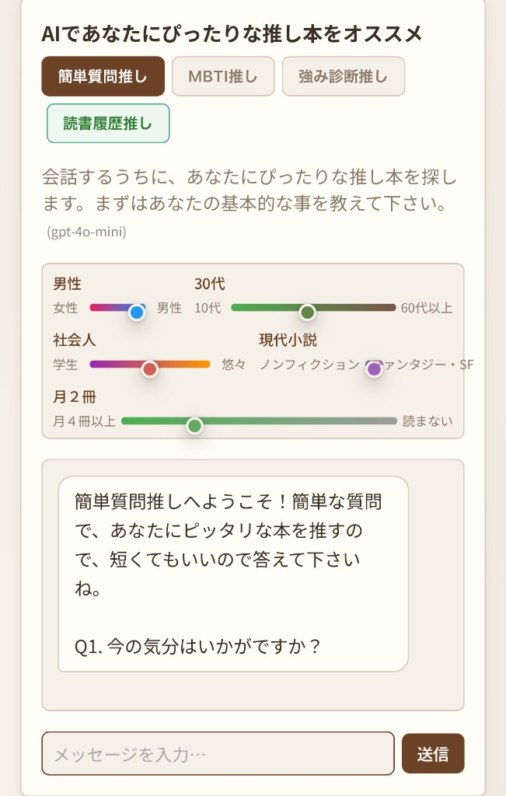
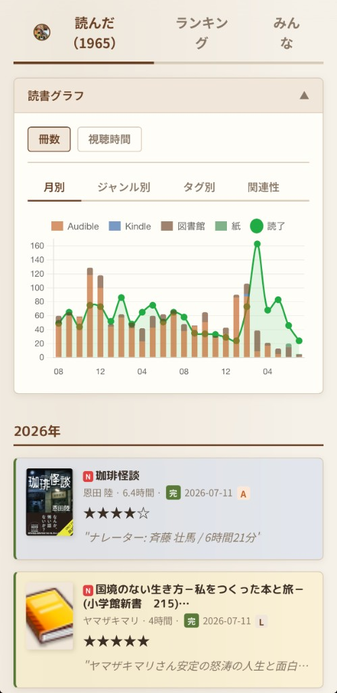

# Cursor + Claude Fable 5 で Amazon 連携アプリを週末だけで開発して収益化する方法

> **yonda** を題材に — Audible・Kindle・公共図書館・紙の本を一元管理し、AI が書評と選書を支援する Web アプリを **週末だけで作り、収益を生む仕組みまで組み込む** 実践書

---

## はじめに — このガイドの目的

このガイドは「完成品のコードを配布する」ものではなく、**AI を使いながら自分でアプリを作り、それを収益につなげるプロセス** を体験してもらうことを目的としています。

そのために、本書は大きく 2 部で構成しています。

- **第I部　Webアプリを作る — 開発手法（1〜27章）**: AI エディタ・モデルの選び方と「AI への頼み方」から始めて、認証・データ連携・AI 機能・デプロイ・運用まで。サンプルアプリ Yonda を実際に作りながら、Web アプリ開発の一連の手法を身につけます
- **第II部　Webアプリを収益化する — マーケティング手法（28〜30章）**: 作ったアプリを「収益を生む資産」に変えます。5 人の経営者の視点による戦略設計、アフィリエイト・KDP 出版・サブスクの実装、そして週末開発を複利にする運用まで

題材アプリ「Yonda」は、筆者が Cursor + Claude を使って週末だけで開発し、いま yonda.ktrips.net で本番稼働している読書記録 Web アプリです。完成までの設計判断・詰まったポイント・AI との対話方法をそのまま記録しています。執筆時点の最新モデルは Anthropic の **Claude Fable 5**（Claude 5 ファミリー）で、本書のコード生成・リファクタ・ドキュメント生成の手法はそのまま適用できます。

あなたが作るアプリは Yonda と同じである必要はありません。読書記録に限らず、「複数のデータソースを統合して AI で付加価値をつける」Web アプリ全般に応用できる構造です。第II部は、**個人開発アプリ全般に使える「週末×AI×資産化」の戦略** としてまとめています。

### 対象読者

- Python の基礎知識がある方（関数・クラスが書ける程度）
- Web アプリを作ったことがない、または初挑戦の方
- 既存のコード生成ツールをもっと効果的に使いたい方
- 趣味の開発を本番環境で動かし、**小さくても収益を生む形にしたい方**

### 本書の読み方

コードは「写経」より「理解」を重視しています。各セクションに **「なぜそうするか」** の説明を入れており、それを Claude に聞くための質問例も載せています。詰まったら気軽に Claude に聞いてください。

第I部（1〜27章）でアプリを作り、第II部（28〜30章）でそれをお金に変える仕組みを設計します。すでにアプリを持っている方は、第II部から読み始めても構いません。

---

## Yonda で学ぶ — できること・作る機能・身につくスキル

本書は、実在のサンプルアプリ **Yonda（yonda.ktrips.net）** をゼロから作ることで学ぶ構成です。「読書が、あなたの財産に。」— 読んだ本が勝手に記録されて積み上がっていくこのアプリの機能ひとつひとつが、そのまま学習テーマになっています。作り終えたとき、次の表の右側があなたのスキルになります。


| Yonda でできること | 実装する機能 | 身につくスキル | 章 |
|---|---|---|---|
| Google アカウントでログインし、自分専用の本棚を持てる | OAuth 認証・マルチユーザー設計・データ分離 | 認証フローと「公開できるアプリ」の土台設計 | 6〜7章 |
| Audible・Kindle の記録が毎朝自動で貯まる | 非公式 API 連携・OTP 認証・セッション管理 | 「公式 API がないサービス」との連携術 | 8〜9章 |
| 図書館の貸出履歴も自動で貯まる。紙の本は写真で登録 | Web スクレイピング・汎用アダプタ・カメラ + AI 抽出 | どのサイトにも応用できる抽象化設計 | 10〜11章 |
| 本の表紙・あらすじ・ジャンルが自動で付く | 外部 API（Google Books 等）+ AI フォールバック | 複数 API の組み合わせとコスト設計 | 12〜13章 |
| 何もしなくても毎朝、全ユーザーの記録が更新される | Cloud Scheduler・バッチ同期・差分検知 | 定期実行とマルチユーザー同期の実務 | 14章 |
| AI が書評を書き、次に読む本を提案してくれる | LLM API（Claude / GPT / Gemini）の組み込み | 生成 AI を「アプリの機能」に変える方法 | 15〜16章 |
| 検索・統計・ランキングがサクサク動く | Vanilla JS の UI・キャッシュ・遅延読み込み | フレームワークなしで速い UI を作る技術 | 17章 |
| 独自ドメインの本番サイトとして公開できる | Cloud Run・GCS・CI/CD・監視・コスト管理 | 月数百円で運用する本番インフラ | 20〜26章 |
| 本の購入リンクから収益が発生する | アフィリエイト・クリック計測・導線設計 | 「機能と収益の一体化」の考え方 | 18章・29章 |
| アプリ自体がお金を生む資産になる | KDP 出版・サブスク（Stripe）・48 時間実験 | 個人開発を複利にするマーケティング | 28〜30章 |

---

## 本書を読むためのガイド

全 30 章を 15 のテーマにまとめました。詳細な章立ては巻頭の目次を参照してください。はじめての方は 1 から順に、経験者は必要なテーマだけ拾い読みできます。収益化だけ知りたい方は第II部（ガイドの 15）から読み始めても構いません。

**第I部　Webアプリを作る — 開発手法**

1. **AI ツールとモデルを選ぶ**（1章）— AI エディタ・LLM の比較と使い分け。開発の道具選びから始めます
2. **Cursor + Claude 開発術**（2章）— AI への頼み方・分割の仕方・プロンプト集。本書全体で使う方法論です
3. **全体像をつかむ**（3章）— Yonda のシステム構成とデータの流れ。何をどの順で作るかを把握します
4. **開発環境と Flask の土台**（4〜5章）— プロジェクト作成から API 設計・キャッシュまで、アプリの骨格を作ります
5. **Google ログインとマルチユーザー**（6〜7章）— 認証と「ユーザーごとのデータ分離」。公開アプリにする分岐点です
6. **Audible・Kindle 連携**（8〜9章）— 本書の核。非公式 API と OTP 認証を突破して読書記録を自動で取ります
7. **図書館と紙の本**（10〜11章）— どの市区町村図書館にも対応できる汎用アダプタ設計と、カメラ + AI での紙の本登録
8. **書誌情報の補完とデータベース**（12〜13章）— Google Books / Open Library / AI の 3 段構えと Firestore 統合
9. **ユーザーごとの自動同期**（14章）— Cloud Scheduler で毎朝全ユーザーの記録が勝手に貯まる仕組み
10. **AI 書評と AI 選書**（15〜16章）— 読了本の書評ポイント生成と、読書履歴からの推薦。AI で付加価値をつけます
11. **フロントエンド UI**（17章）— フレームワークなしの Vanilla JS で作る理由と実装パターン
12. **アフィリエイトとコミュニティ**（18〜19章）— Amazon 連携リンクと「みんなの読書」。第II部の伏線です
13. **デプロイと開発の実務**（20〜22章）— Cloud Run 本番公開、ローカルデバッグ、テスト戦略
14. **性能・運用・トラブル対策**（23〜27章）— パフォーマンス・監視・セキュリティ・コスト・実際にハマった問題集

**第II部　Webアプリを収益化する — マーケティング手法**

15. **収益化の戦略と実装**（28〜30章）— 5 人の視点で戦略を設計し、アフィリエイト・KDP・サブスクを実装し、48 時間実験と資産化で週末開発を複利にする

---

# 第I部　Webアプリを作る — 開発手法（1〜27章）

AI エディタとモデルの選び方から始めて、環境構築・認証・データ連携・AI 機能・デプロイ・運用まで。サンプルアプリ **Yonda** を実際に作りながら、Web アプリ開発の一連の手法を身につけます。

---

## 1. AI ツール・モデル完全比較

アプリ開発に使える AI ツールは急速に増えています。本章では **エディタ（IDE）** と **AI モデル（LLM）** の 2 つの軸で比較し、用途ごとの最適な組み合わせを解説します。

---

### AI コードエディタの比較

#### Cursor

2023 年に登場した AI ネイティブのコードエディタ。VS Code をフォークしており、既存の VS Code 拡張機能をそのまま使えます。

**強み**
- `@ファイル名` でコンテキストを指定したチャットが直感的
- Composer（Agent モード）で複数ファイルをまたいだ変更が 1 回の指示で完結
- Tab 補完の精度が高い（GPT-4o / Claude Sonnet をリアルタイムで使用）
- コードベース全体をインデックス化して「このプロジェクトのどこで〇〇している？」が答えられる

**弱み**
- 月額 $20（Pro）の有料プランが実質必須
- 大きすぎるファイルはコンテキストウィンドウに入りきらない
- UI が VS Code と微妙に異なりショートカットに慣れが必要

**料金**
| プラン | 月額 | AI 利用 |
|--------|------|--------|
| Free | $0 | 月 50 回（遅いモデル）|
| Pro | $20 | 無制限（低速）+ 高速モデル 500 回/月 |
| Business | $40/人 | チーム管理機能付き |

#### GitHub Copilot

GitHub（Microsoft）が提供する AI コーディング支援ツール。VS Code・JetBrains・Neovim などほぼすべての主要 IDE に対応しています。

**強み**
- VS Code 拡張として軽量に動作（エディタ全体の置き換え不要）
- GitHub リポジトリとの連携が自然
- 企業向けのセキュリティ・コンプライアンス対応が充実
- Chat・Inline Edit・Workspace Agent と機能が揃ってきた

**弱み**
- Cursor のような「プロジェクト全体を理解した回答」が弱い
- マルチファイル編集は Cursor より手間がかかる
- GPT-4o / Claude Sonnet を使えるが切り替えが面倒

**料金**
| プラン | 月額 | 備考 |
|--------|------|------|
| Individual | $10 | 個人利用 |
| Business | $19/人 | 組織管理機能 |
| Enterprise | $39/人 | セキュリティ強化版 |

#### Windsurf（旧 Codeium）

AI エージェント特化型の新興エディタ。「Cascade」と呼ばれるエージェントが自律的にタスクを実行します。

**強み**
- 無料プランが充実（GPT-4o クラスのモデルを一定回数無料で使える）
- Cascade エージェントが Cursor の Composer に相当する自律編集をより積極的に実行
- 軽量で起動が速い

**弱み**
- Cursor ほどのコミュニティと情報量がない
- 拡張機能のエコシステムが VS Code より限定的

#### VS Code + GitHub Copilot / Cline

「エディタはそのまま、拡張機能で AI を追加」するアプローチ。Cline は VS Code 拡張として Claude や GPT-4o を使ったエージェント機能を提供します。

**強み**
- 既存の VS Code 環境を変えずに済む
- Cline は OSS でモデルを自由に選べる（Ollama によるローカルモデルも可）

**弱み**
- Cursor の Tab 補完ほどシームレスではない
- コンテキスト管理を自分で行う必要がある

#### エディタ総合比較表

| 項目 | Cursor | GitHub Copilot | Windsurf | Cline（VS Code）|
|------|--------|----------------|----------|----------------|
| 無料で使える | △（制限あり）| △（Pro必須推奨）| ◎ | ◎（OSS）|
| Tab 補完精度 | ◎ | ○ | ○ | △ |
| マルチファイル編集 | ◎ | ○ | ◎ | ○ |
| プロジェクト全体理解 | ◎ | ○ | ○ | △ |
| 既存 IDE との互換性 | ○（VSCode互換）| ◎ | ○ | ◎ |
| 日本語対応 | ○ | ○ | ○ | ○ |
| **本書での推奨** | **◎ 第一選択** | ○ | ○ | △ |

---

### AI モデル（LLM）の比較

エディタとは別に、バックエンドで使う AI モデルの選択も重要です。本アプリではジャンル補完・書評生成・選書推薦に AI を使います。

#### Claude（Anthropic）

**シリーズ: Claude 5 ファミリー（Fable 5）/ Opus 4.8 / Sonnet 5 / Haiku 4.5**

Anthropic が開発する LLM。コード生成能力が非常に高く、長い文脈（最新世代は 1M トークン）を正確に処理できます。本書の参考アプリ yonda の開発では **Claude をメインに使用**しました。執筆時点の最上位は **Claude Fable 5**（Mythos クラスと呼ばれる Opus より上位の新ティア）で、長時間の自律的なエージェント作業・大規模リファクタに特に強く、Cursor などの AI エディタから使うと「仕様を渡して丸ごと実装させる」使い方が現実的になっています。

**コード生成での特徴**
- 複雑な Python コードの生成精度が高い
- 「このコードのバグを直して」という修正指示への追従が正確
- 長いファイル全体を渡して「この関数をリファクタリングして」が得意
- Fable 5 / Opus 4.8 世代は長時間タスクの自律実行・自己検証が大幅に向上
- 安全性を重視した設計のため、危険な操作には自動で注意を添える

**API 料金（2026年時点の目安）**

| モデル | 入力 | 出力 | 用途 |
|--------|------|------|------|
| Claude Haiku 4.5 | $1.00/MTok | $5.00/MTok | ジャンル推定・軽量タスク |
| Claude Sonnet 5 | $3.00/MTok | $15.00/MTok | 書評生成・コード補完のバランス型 |
| Claude Opus 4.8 | $5.00/MTok | $25.00/MTok | 高品質なコード生成・長文生成 |
| Claude Fable 5 | $10.00/MTok | $50.00/MTok | 最難関の推論・長時間エージェント作業 |

#### OpenAI GPT シリーズ

**シリーズ: GPT-4o / GPT-4o mini / o1 / o3**

最も広く使われている LLM。ライブラリ・ドキュメント・サンプルコードが豊富で、困ったときに検索すれば情報が見つかりやすいです。

**コード生成での特徴**
- 幅広い言語・フレームワークに対応
- GPT-4o は画像入力にも対応（本の表紙写真からタイトル抽出に最適）
- o1 / o3 シリーズは「考える」ステップを踏むため複雑な論理タスクに強い
- 関数呼び出し（Function Calling）の実装が成熟している

**API 料金（2026年6月時点の目安）**

| モデル | 入力 | 出力 | 用途 |
|--------|------|------|------|
| gpt-4o-mini | $0.15/MTok | $0.60/MTok | ジャンル推定（最安） |
| gpt-4o | $5.00/MTok | $15.00/MTok | 書評生成・画像解析 |
| o1-mini | $3.00/MTok | $12.00/MTok | 複雑なロジック生成 |
| o3 | $10.00/MTok | $40.00/MTok | 最高精度が必要な場合 |

#### Google Gemini

**シリーズ: Gemini 2.0 Flash / Gemini 1.5 Pro / Gemini Ultra**

Google が開発する LLM。Google Cloud との統合が自然で、Cloud Run + Firestore との組み合わせで IAM 認証を使った安全な呼び出しができます。

**コード生成での特徴**
- Gemini 2.0 Flash は高速・低コストでジャンル補完などの軽量タスクに最適
- Google Workspace（Google Docs / Sheets）との連携が得意
- 無料枠（1 分 15 リクエスト、1 日 1,500 リクエスト）が比較的大きい

**API 料金（2026年6月時点の目安）**

| モデル | 入力 | 出力 | 無料枠 |
|--------|------|------|--------|
| gemini-2.0-flash | $0.075/MTok | $0.30/MTok | あり |
| gemini-1.5-pro | $1.25/MTok | $5.00/MTok | あり（制限小）|
| gemini-ultra | $7.00/MTok | $21.00/MTok | なし |

#### ローカル LLM（Ollama）

Ollama を使うと、MacBook / Linux 上で LLM をローカル実行できます。API 料金ゼロ・データがクラウドに送られないという強みがあります。

```bash
# Ollama のインストール
curl -fsSL https://ollama.ai/install.sh | sh

# モデルのダウンロードと実行
ollama pull llama3.2
ollama run llama3.2

# Python から API 呼び出し（OpenAI 互換インターフェース）
from openai import OpenAI
client = OpenAI(base_url="http://localhost:11434/v1", api_key="ollama")
```

**向いているケース**
- 社内の機密データを含むコード生成
- 開発コストをゼロに抑えたい実験段階
- インターネット接続なしでの開発

**向いていないケース**
- 本番環境での API 呼び出し（M1 Mac でも GPT-4o より遅い）
- 日本語品質が重要な書評生成

---

### 用途別モデル選択ガイド

#### コード生成（開発時）

| 優先事項 | 推奨 | 理由 |
|---------|------|------|
| **品質最優先** | Claude 3.5 Sonnet（Cursor 経由）| コード精度・文脈理解が最高水準 |
| **コスト最小** | gpt-4o-mini / gemini-2.0-flash | 1 リクエスト 0.1 円以下 |
| **オフライン** | Ollama + llama3.2 / qwen2.5-coder | ローカル実行 |

#### 書評・ジャンル生成（本番 API）

```python
# 用途別モデル推奨設定
AI_MODEL_SETTINGS = {
    "genre_detection": {
        "openai":  "gpt-4o-mini",       # 最安・十分な精度
        "gemini":  "gemini-2.0-flash",  # 無料枠活用
        "anthropic": "claude-3-haiku",  # 高速・低コスト
    },
    "book_review": {
        "openai":  "gpt-4o",            # 高品質な書評
        "gemini":  "gemini-1.5-pro",    # バランスが良い
        "anthropic": "claude-3-sonnet", # 長文品質が高い
    },
    "image_recognition": {
        "openai":  "gpt-4o",            # Vision 必須
        "gemini":  "gemini-1.5-pro",    # マルチモーダル対応
        # anthropic: claude-3-sonnet も画像対応
    },
}
```

#### プロバイダー切り替えの実装

```python
def _call_ai_auto(prompt: str, task: str = "genre_detection",
                  max_tokens: int = 200) -> str:
    """タスクに応じた最適モデルで AI を呼び出す。
    環境変数 AI_PROVIDER でプロバイダーを切り替え可能。"""
    ai_config = library_service.load_ai_config()
    provider = ai_config.get("provider", "openai")
    model = AI_MODEL_SETTINGS.get(task, {}).get(provider, "")

    if not model:
        raise ValueError(f"プロバイダー {provider} のタスク {task} 用モデルが未定義")

    return _call_ai_with_model(provider, model, prompt, max_tokens, ai_config)

def _call_ai_with_model(provider: str, model: str, prompt: str,
                        max_tokens: int, config: dict) -> str:
    if provider == "openai":
        import openai
        client = openai.OpenAI(api_key=config["api_key"])
        resp = client.chat.completions.create(
            model=model,
            messages=[{"role": "user", "content": prompt}],
            max_tokens=max_tokens,
        )
        return resp.choices[0].message.content or ""

    if provider == "gemini":
        import google.generativeai as genai
        genai.configure(api_key=config["api_key"])
        m = genai.GenerativeModel(model)
        return m.generate_content(prompt).text or ""

    if provider == "anthropic":
        import anthropic
        client = anthropic.Anthropic(api_key=config["api_key"])
        msg = client.messages.create(
            model=model,
            max_tokens=max_tokens,
            messages=[{"role": "user", "content": prompt}],
        )
        return msg.content[0].text or ""

    raise ValueError(f"未知のプロバイダー: {provider}")
```

---

### Cursor と Claude の組み合わせが最強の理由

このアプリ開発で最終的に **Cursor（エディタ）× Claude（モデル）** の組み合わせを選んだ理由を整理します。

**① マルチファイル編集の一貫性**

Flask アプリでは `app.py`・`library_service.py`・`firestore_service.py` が密結合しています。「`library_service.py` の関数 A のシグネチャを変えて、`app.py` の呼び出し元も全部修正して」という指示が、Cursor の Composer + Claude では 1 回で完結します。

**② 長い Python ファイルの理解力**

`app.py` は 4,000 行を超えています。Claude はこのサイズのファイルを渡しても「〇〇行目の関数との関係を考慮した上で修正して」という指示を正確に理解します。GPT-4o も優秀ですが、長いコンテキストの一貫性は Claude のほうが安定しています。

**③ エラーへの的確な対応**

このアプリ開発で発生した `MismatchingStateError`・`Working outside of request context`・Firestore バッチ制限などのエラーは、すべてスタックトレースを Claude に貼るだけで根本原因と修正コードが返ってきました。

**④ 「なぜ」を説明してくれる**

```
「threading.local() を使う理由を、マルチユーザーとの関係で
小学生でもわかるように説明して」
```

この質問に対して Claude は図解を含めた分かりやすい説明を返します。コードを書くだけでなく、理解を深めながら開発できる点が GPT-4o との差別化ポイントです。

---

### 2026年現在のベストプラクティス

```
【開発フェーズ別推奨構成】

企画・設計:
  Cursor Chat + Claude 3.5 Sonnet
  → アーキテクチャ相談・技術選定

実装:
  Cursor Composer + Claude 3.5 Sonnet（Tab補完）
  → マルチファイル編集・バグ修正

本番API（ジャンル補完）:
  gpt-4o-mini または gemini-2.0-flash
  → コスト効率優先

本番API（書評生成）:
  gpt-4o または claude-3-sonnet
  → 品質優先

画像認識（表紙→タイトル抽出）:
  gpt-4o（Vision）
  → マルチモーダル必須

コスト削減フェーズ:
  Gemini の無料枠を最大活用
  → 無料枠内ではほぼ0円で運用可能
```

---

## 2. Cursor + Claude を使った開発の進め方

### なぜ Cursor + Claude か

このアプリは **Cursor（AI コードエディタ）と Claude（Anthropic の大規模言語モデル）** を使って短期間で開発しました。

```
開発期間の比較:
- 従来の開発: 2〜3ヶ月
- Cursor + Claude: 週末2日 + 細部の調整数日
```

### 効果的な使い方

#### 1. 全体設計を Claude に相談する

```
「PythonとFlaskで読書記録アプリを作りたい。
AudibleとKindleと図書館から本を自動取得して、
AIで書評を生成する機能が欲しい。
複数ユーザーにも対応したい。
全体アーキテクチャを教えて」
```

Claude はアーキテクチャ案・技術選定・実装方針を詳細に提案します。

#### 2. スモールスタートで始める

```
Week 1: Flask + Google OAuth + 書籍データのJSONファイル保存
Week 2: Audible連携 or 図書館連携を追加
Week 3: フロントエンドを整える + Cloud Runデプロイ
Week 4: マルチユーザー対応 + Firestore統合
```

最初から「マルチユーザー対応」「Firestore」を目指さず、**まず動くもの**を作ってから段階的に拡張するのが成功のコツです。

#### 3. エラーはそのまま Claude に貼る

```
「以下のエラーが出ています。修正してください:

MismatchingStateError: CSRF Warning! State not equal in request and response.
  File "app.py", line 45, in auth_callback」
```

Claude はエラーの原因と解決策を即座に提案します。このアプリ開発でも同じエラーが発生し、Claude が提案したファイルシステムバックアップ方式で解決しました。

#### 4. 「なぜそうするか」を聞く

Claude が生成したコードが理解できない場合は説明を求めます。

```
「このコードの threading.local() の部分が
マルチユーザーに必要な理由を説明して」
```

理解せずに使うのではなく、Claude を「説明してくれる先生」として活用することで、知識も同時に習得できます。

#### 5. Cursor のマルチファイル編集を活用

Cursor は複数ファイルを同時に編集できます。

```
「app.py と library_service.py の両方を修正して、
スレッドローカルによるユーザー分離を実装して」
```

この指示が 1 回で効きます。

#### 6. 機能追加のプロンプト例

```
# 新機能追加
「現在の実装に、図書館の貸出履歴を取得する機能を追加したい。
世田谷区立図書館のHTMLスクレイピングで実装して。
ログインページのURLは https://... で、フォームのフィールド名は userId と password」

# リファクタリング
「現在の setagaya.py をベースに、
どの図書館でも設定ファイルだけで対応できる汎用アダプタに書き直して」

# パフォーマンス改善
「2000冊の書籍リストを表示する際にブラウザがフリーズする。
ページネーションと DocumentFragment を使って改善して」
```

### Cursor の主要機能と使い方

#### Chat（チャット）

現在開いているファイルを自動的にコンテキストとして参照します。

```
「@app.py の auth_callback 関数に
エラーハンドリングを追加して」
```

#### Composer（コンポーザー）

複数ファイルにまたがる変更を一度に行います。

```
「@app.py @library_service.py @firestore_service.py
の3つを修正して、マルチユーザーの自動同期機能を追加して」
```

#### Tab 補完

コードを書きながら Claude がリアルタイムで次のコードを提案します。

### 週末開発のタイムライン例

```
土曜日 午前（3時間）:
  09:00 プロジェクト作成・Flask基盤
  10:00 Google OAuth実装
  11:00 基本的なUIテンプレート作成

土曜日 午後（4時間）:
  13:00 Audibleアダプタ実装
  15:00 書籍データの保存・表示
  17:00 フィルタ・ソート機能

日曜日 午前（3時間）:
  09:00 図書館アダプタ実装
  10:30 書誌情報自動補完（Google Books）
  11:30 Cloud Runデプロイ

日曜日 午後（4時間）:
  13:00 UIの改善・モバイル対応
  14:30 AI書評機能
  16:00 Firestoreデータベース統合
  17:00 マルチユーザー化（threading.local）
```

### 実際に詰まったポイントと解決策

| 問題 | 原因 | 解決策 |
|------|------|--------|
| Cloud Run で MismatchingStateError | セッション Cookie がインスタンス間で共有されない | OAuth ステートを GCS にファイルで保存 |
| Kindle データが取得できない | Amazon の OTP 認証 | セッションストア + OTP フロー実装 |
| 2,000 冊表示でブラウザが固まる | DOM 操作が重い | ページネーション + DocumentFragment |
| 図書館の自動同期がタイムアウト | HTTP リクエストにタイムアウト設定なし | `timeout=(10, 30)` を全リクエストに追加 |
| マルチユーザーでデータが混在 | グローバル変数にデータを保持 | threading.local でスレッドごとに分離 |
| Firestore への書き込みが失敗 | バッチ書き込みの 500 件制限 | 499 件ごとにコミットを分割 |
| ジャンル補完が途中で止まる | 外部 API のレート制限 | 指数バックオフ + AI フォールバック |
| 同期後に既存のジャンルが消える | skip_enrich=True で全データを上書き | 既存データを保持した上でスキップ |

### Cursor + Claude での失敗パターンと回避策

#### 失敗1: 一度に大きすぎる変更を依頼する

```
# NG: 一度に全部頼む
「全部作って」「アプリをマルチユーザー化して」

# OK: 小さく分けて依頼する
「まず library_service.py に threading.local を追加して」
「次に before_request でユーザーデータディレクトリをセットして」
「最後に Firestore の同期設定フラグを追加して」
```

#### 失敗2: コードを見ずに「動いた」と思い込む

Claude の生成コードは必ず動作確認が必要です。特に以下の点を確認してください。

- エラーハンドリングが適切か
- セキュリティホールがないか
- パフォーマンスに問題がないか

#### 失敗3: コンテキストを提供しない

```
# NG: コンテキストなし
「エラーを直して」

# OK: ファイルとエラーを含める
「@app.py の以下のエラーを直して。
エラー内容: [スタックトレース全文]
関連コード: [エラー箇所のコード]」
```

---

## 3. 全体アーキテクチャ

### システム構成図

```
┌─────────────────────────────────────────────────────────┐
│                      ブラウザ                             │
│  index.html + app.js + style.css                         │
│  (Vanilla JS / Chart.js)                                 │
└─────────────────┬────────────────────────────────────────┘
                  │ HTTP/JSON
┌─────────────────▼────────────────────────────────────────┐
│               Flask (app.py)                              │
│  ┌──────────────┐  ┌──────────────┐  ┌───────────────┐  │
│  │ Google OAuth  │  │ API Routes   │  │ Internal API  │  │
│  │ /auth/*       │  │ /api/*       │  │ /api/internal │  │
│  └──────────────┘  └──────┬───────┘  └───────────────┘  │
│                            │                              │
│  ┌─────────────────────────▼──────────────────────────┐  │
│  │           library_service.py                        │  │
│  │  load_saved() → Firestore優先 → JSONフォールバック  │  │
│  │  fetch_and_save() → アダプタ → JSON + Firestore     │  │
│  └──────┬─────────────┬────────────────────────────────┘  │
│         │             │                                    │
│  ┌──────▼──────┐ ┌────▼──────────────┐                   │
│  │ adapters/   │ │ firestore_service  │                   │
│  │ audible.py  │ │ .py                │                   │
│  │ kindle.py   │ └────────────────────┘                   │
│  │ library.py  │  ← 汎用図書館アダプタ                    │
│  └─────────────┘                                          │
└──────────────────┬───────────────────────────────────────┘
                   │
    ┌──────────────┼──────────────────┐
    ▼              ▼                  ▼
┌───────┐  ┌─────────────┐  ┌──────────────────┐
│ GCS   │  │  Firestore  │  │   外部API        │
│(JSON) │  │ (books DB)  │  │ Google Books     │
│       │  │             │  │ Open Library     │
│       │  │             │  │ OpenAI / Gemini  │
└───────┘  └─────────────┘  └──────────────────┘
```

### 技術スタック

| 領域 | 技術 |
|------|------|
| バックエンド | Python 3.11+ / Flask 3.0 |
| フロントエンド | Vanilla JavaScript / CSS（フレームワークなし）|
| データベース | Google Cloud Firestore |
| ストレージ | Google Cloud Storage（GCS）|
| ホスティング | Google Cloud Run |
| 認証 | Google OAuth 2.0（authlib）|
| AI | OpenAI GPT-4o / Google Gemini |
| 書誌情報 | Google Books API / Open Library API |

### なぜこの技術スタックを選んだか

**Flask（軽量 Web フレームワーク）**: Django と比べてファイル数が少なく、AI が全体像を把握しやすい。1 ファイルで動く最小構成から始められる。

**Vanilla JavaScript**: React / Vue / Svelte などのフレームワークは Claude が生成しやすいが、ビルドステップが不要な素の JS のほうが「ファイルを変更してリロード」だけで動く。趣味開発の速度に最適。

**Firestore（ドキュメント DB）**: スキーマレスなので「後でフィールドを追加する」が自由にできる。Cloud Run との IAM 統合で認証設定が不要。無料枠が充実（1 日 5 万読取、2 万書込）。

**Cloud Run（コンテナ実行）**: サーバー管理不要。使った分だけ課金。スケールゼロ（アクセスがない時は料金ゼロ）。

### データモデル

#### BookRecord（書籍 1 冊のデータ構造）

```python
@dataclass
class BookRecord:
    title: str                    # タイトル
    author: str                   # 著者/ナレーター
    loan_date: str                # 取得/貸出日 (YYYY-MM-DD)
    loan_location: str            # 貸出場所・ストア名
    rating: int                   # 評価 0-5
    comment: str                  # コメント
    cover_url: str                # 表紙画像URL
    detail_url: str               # 商品/詳細ページURL
    catalog_number: str           # ASIN または図書館資料番号
    completed: bool               # 読了/聴了フラグ
    source: str                   # "audible_jp" / "kindle" / "library_xxx" / "paper"
    genre: str                    # ジャンル（正規化済み）
    summary: str                  # 概要（短縮版）
    full_summary: str             # 概要（全文）
    completed_date: str           # 読了日 (YYYY-MM-DD)
    percent_complete: float       # 読書進捗 0.0-1.0
    favorite: bool                # お気に入りフラグ
    review_headline: str          # Audible レビュー見出し
    catalog_rating: float         # ストアの平均評価
    runtime_length_min: int       # 再生時間（分）
```

#### Firestore のコレクション構造

```
users/
  {google_uid}/
    books/
      {source}_{catalog_number}   ← 本1冊ずつのドキュメント
      {sha256_hash[:16]}          ← catalog_numberがない場合のID
    sources/
      audible_jp                  ← ソース別メタデータ
      library_setagaya
      kindle
      paper
community/
  messages_meta/
    items/
      {message_id}               ← みんなの読書記録メッセージ
```

### データフロー詳細

```
【同期フロー】
Cloud Scheduler
  → POST /api/internal/auto-fetch-all
    → Firestore から同期対象ユーザー一覧を取得
      → 各ユーザーの data/users/{uid}/ を参照
        → AudibleAdapter / KindleAdapter / LibraryAdapter で取得
          → library_service.fetch_and_save() で保存
            → JSON ファイル (GCS) + Firestore に書き込み

【読み込みフロー】
ブラウザ GET /api/books
  → Flask: session から uid を取得
    → library_service.load_saved() を呼び出し
      → キャッシュチェック（mtime ベース）
        → Firestore から読み込み（失敗時はJSONフォールバック）
          → JSON レスポンスとして返却
```

---

## 4. 開発環境のセットアップ

### 必要なもの

- Python 3.11 以上
- Google Cloud アカウント（無料枠で動作）
- Audible アカウント（Audible 連携する場合）
- Amazon アカウント（Kindle 連携する場合）
- OpenAI または Google Gemini の API キー（AI 機能を使う場合）

### プロジェクトの作成

```bash
mkdir myapp && cd myapp

# Python仮想環境
python3 -m venv venv
source venv/bin/activate  # Windows: venv\Scripts\activate

# 依存パッケージのインストール
pip install flask flask-compress requests beautifulsoup4 lxml \
            gunicorn authlib google-cloud-firestore
```

### ディレクトリ構成

```
myapp/
├── app.py                  # Flaskアプリ本体
├── library_service.py      # データ取得・保存ロジック
├── firestore_service.py    # Firestore読み書き
├── config_paths.py         # パス設定
├── requirements.txt
├── Dockerfile
├── adapters/
│   ├── __init__.py
│   ├── base.py             # 基底クラス（全アダプタ共通）
│   ├── audible.py          # Audible
│   ├── kindle.py           # Kindle
│   └── library_base.py     # 図書館スクレイピング基底クラス
├── templates/
│   ├── index.html
│   └── help_usage.html
├── static/
│   ├── app.js
│   └── style.css
└── data/                   # ローカル開発時のデータ置き場
    └── .gitkeep
```

### requirements.txt の作成

```
flask>=3.0.0
flask-compress>=1.14
requests>=2.31.0
beautifulsoup4>=4.12.0
lxml>=4.9.0
gunicorn>=21.0.0
authlib>=1.3.0
google-cloud-firestore>=2.16.0
google-cloud-storage>=2.16.0
openai>=1.30.0
google-generativeai>=0.5.0
audible>=0.10.0
python-dotenv>=1.0.0
```

### .env ファイルの設定

ローカル開発では `.env` ファイルに環境変数を設定します。**絶対に git にコミットしないこと**。

```bash
# .env（.gitignore に追加すること）
FLASK_SECRET_KEY=local-dev-secret-change-in-production
GOOGLE_CLIENT_ID=your-google-client-id.apps.googleusercontent.com
GOOGLE_CLIENT_SECRET=your-google-client-secret
DATA_DIR=data
YONDA_INTERNAL_TOKEN=local-dev-internal-token
```

```python
# app.py の先頭で読み込む
from dotenv import load_dotenv
load_dotenv()
```

### .gitignore の設定

```gitignore
# 環境変数・認証情報
.env
*.json  # credentials は除外（例外はあとで追加）
!requirements*.json

# 開発用データ
data/
!data/.gitkeep

# Python
__pycache__/
*.pyc
venv/
.venv/

# IDE
.DS_Store
.idea/
*.swp
```

---

## 5. Flask アプリの基盤構築

### app.py の全体構造

```python
from flask import Flask
from flask_compress import Compress
from werkzeug.middleware.proxy_fix import ProxyFix
import library_service

app = Flask(__name__)

# gzip圧縮（JSONレスポンスを大幅に圧縮）
Compress(app)

# Cloud Run のリバースプロキシ対応（HTTPSリダイレクト等）
app.wsgi_app = ProxyFix(app.wsgi_app, x_proto=1, x_host=1)

# セッション暗号化キー（全インスタンスで同一である必要あり）
app.secret_key = os.environ.get("FLASK_SECRET_KEY", "dev-secret-key")

# リクエストごとにユーザーデータディレクトリをセット
@app.before_request
def _before_request_handler():
    library_service.set_user_data_dir(get_user_data_dir_for_session())
```

### API ルートの設計方針

```python
# 公開API（ログイン不要）
GET  /api/books              ← 全書籍一覧（自分のデータ）
GET  /api/stats              ← 統計情報
GET  /api/public-user-stats  ← 全ユーザーの読了数（公開）

# 認証が必要なAPI
POST /api/books/{id}/rating    ← 評価の更新
POST /api/books/{id}/comment   ← コメントの更新
POST /api/enrich-library-genre ← ジャンル補完
GET  /api/ai-recommend         ← AI選書
POST /api/book-insights/generate ← AI書評生成

# 内部API（Cloud Scheduler専用）
POST /api/internal/auto-fetch-all ← 全ユーザー同期
```

### スレッドローカルによるユーザーデータ分離

Cloud Run は複数リクエストを並列処理します。どのユーザーのデータを読むかをスレッドごとに管理することが、マルチユーザー化の核心です。

```python
# library_service.py
import threading
_tls = threading.local()

def set_user_data_dir(path: Path) -> None:
    """リクエストごとのユーザーデータディレクトリをセット"""
    _tls.user_data_dir = path

def get_user_data_dir() -> Path:
    """現在スレッドのユーザーデータディレクトリを返す"""
    return getattr(_tls, 'user_data_dir', DATA_DIR)
```

### mtime ベースのキャッシュ

```python
_saved_caches: dict[str, Optional[dict]] = {}
_saved_cache_mtimes: dict[str, float] = {}

def load_saved() -> Optional[dict]:
    key = str(get_user_data_dir())
    max_mtime = _get_books_max_mtime()
    if _saved_caches.get(key) is not None and max_mtime <= _saved_cache_mtimes.get(key, 0.0):
        return _saved_caches[key]  # キャッシュ利用
    result = _load_saved_uncached()
    _saved_caches[key] = result
    _saved_cache_mtimes[key] = max_mtime
    return result
```

### レスポンスの gzip 圧縮効果

書籍 2,000 冊の JSON は素のまま約 1.5 MB あります。`flask-compress` を有効にするだけで自動的に gzip 圧縮され、転送量が **約 80% 削減**（300 KB 程度）されます。

```python
from flask_compress import Compress
Compress(app)
# ← これだけで全レスポンスが自動圧縮される
```

---

## 6. Google OAuth 認証の実装

### Google Cloud Console での設定

1. [Google Cloud Console](https://console.cloud.google.com/) でプロジェクトを作成
2. 「API とサービス」→「認証情報」→「OAuth クライアント ID を作成」
3. アプリケーションの種類: **ウェブアプリケーション**
4. 承認済みリダイレクト URI に追加:
   - `http://localhost:5002/auth/callback`（開発用）
   - `https://your-cloudrun-url/auth/callback`（本番用）

### authlib による OAuth 実装

```python
from authlib.integrations.flask_client import OAuth

oauth = OAuth(app)
oauth.register(
    name="google",
    client_id=os.environ.get("GOOGLE_CLIENT_ID"),
    client_secret=os.environ.get("GOOGLE_CLIENT_SECRET"),
    server_metadata_url="https://accounts.google.com/.well-known/openid-configuration",
    client_kwargs={"scope": "openid email profile"},
)

@app.route("/auth/login")
def auth_login():
    state = os.urandom(16).hex()
    _save_oauth_state_to_fs(state, GOOGLE_REDIRECT_URI)
    return oauth.google.authorize_redirect(GOOGLE_REDIRECT_URI, state=state)

@app.route("/auth/callback")
def auth_callback():
    state = request.args.get("state", "")
    _restore_oauth_state_from_fs(state)
    try:
        token = oauth.google.authorize_access_token()
    except MismatchingStateError:
        return redirect(url_for("auth_login"))

    user = token.get("userinfo") or oauth.google.userinfo(token=token)
    session["user"] = {
        "sub":     user["sub"],      # Google UID（不変の識別子）
        "email":   user["email"],
        "name":    user.get("name", ""),
        "picture": user.get("picture", ""),
    }
    _migrate_root_data_to_user(user["sub"])
    return redirect("/")
```

### Cloud Run でセッションが消える問題の解決

Cloud Run はリクエストごとに異なるインスタンスで処理されることがあります。OAuth の state がセッションから消えると `MismatchingStateError` が発生します。

**解決策: OAuth ステートをファイルシステム（GCS マウント）にバックアップ**

```python
_OAUTH_STATE_DIR = Path(os.environ.get("DATA_DIR", "data")) / ".oauth_states"

def _save_oauth_state_to_fs(state: str, redirect_uri: str) -> None:
    _OAUTH_STATE_DIR.mkdir(parents=True, exist_ok=True)
    state_file = _OAUTH_STATE_DIR / f"oauth_state_{state}.json"
    state_file.write_text(json.dumps({
        "state": state,
        "redirect_uri": redirect_uri,
        "created_at": time.time(),
    }))

def _restore_oauth_state_from_fs(state: str) -> bool:
    state_key = f"_state_google_{state}"
    if state_key in session:
        return True  # セッションにある場合はそのまま
    state_file = _OAUTH_STATE_DIR / f"oauth_state_{state}.json"
    if not state_file.exists():
        return False
    data = json.loads(state_file.read_text())
    if time.time() - data["created_at"] > 600:  # 10分で期限切れ
        state_file.unlink(missing_ok=True)
        return False
    session[state_key] = {
        "state": data["state"],
        "redirect_uri": data["redirect_uri"],
    }
    state_file.unlink(missing_ok=True)
    return True
```

### ログアウト実装

```python
@app.route("/auth/logout")
def auth_logout():
    session.clear()
    return redirect("/")
```

### ログイン状態の確認

```python
def get_current_user() -> dict | None:
    """セッションからログイン中ユーザー情報を返す"""
    try:
        return session.get("user")
    except RuntimeError:
        # バックグラウンドスレッドからの呼び出し時はNoneを返す
        return None

def _get_current_uid() -> str | None:
    user = get_current_user()
    return user["sub"] if user else None
```

---

## 7. マルチユーザー設計

### 設計の考え方

1 人用アプリをマルチユーザー化する際の核心は「**誰のデータか**」をリクエストごとに正確に把握することです。yonda は以下の 2 層でユーザーデータを分離しています。

```
【ファイル層】GCS マウント
data/
  users/
    {google_uid}/
      audible_books.json      ← Audibleの本
      library_books.json      ← 図書館の本
      kindle_books.json       ← Kindleの本
      paper_books.json        ← 紙の本
      credentials.json        ← 図書館ID/PW（暗号化推奨）
      auth_jp.json            ← Audible認証トークン
      kindle_session.json     ← Kindleセッション

【DB層】Firestore
users/
  {google_uid}/
    profile                   ← 名前・メール・アイコン・同期設定
    books/
      {book_id}               ← 本データ（全ソース統合）
```

### スレッドローカルによる分離の仕組み

```
リクエスト → before_request → set_user_data_dir(users/{uid}/)
                                       ↓
                           library_service.get_user_data_dir()
                                       ↓
                           data/users/{uid}/ 配下を読み書き
```

Flask は 1 リクエスト = 1 スレッドで処理するため、スレッドローカル変数に「今どのユーザーのディレクトリを使うか」を持たせることで、並行リクエストが混在しません。

```python
# app.py
@app.before_request
def _before_request_handler():
    user = get_current_user()
    if user:
        uid_safe = re.sub(r"[^a-zA-Z0-9_\-]", "_", user["sub"])
        user_dir = library_service.DATA_DIR / "users" / uid_safe
        user_dir.mkdir(parents=True, exist_ok=True)
        library_service.set_user_data_dir(user_dir)
    else:
        library_service.set_user_data_dir(library_service.DATA_DIR)
```

### 初回ログイン時のデータ移行

既存の 1 人用データを最初にログインしたユーザーに引き継ぐ仕組みです。

```python
def _migrate_root_data_to_user(uid: str) -> None:
    uid_safe = re.sub(r"[^a-zA-Z0-9_\-]", "_", uid)
    sentinel = library_service.DATA_DIR / ".data_migrated"
    user_dir = library_service.DATA_DIR / "users" / uid_safe
    user_dir.mkdir(parents=True, exist_ok=True)

    # 既にユーザーデータがあればスキップ
    if any((user_dir / f).exists() for f in ["audible_books.json", "library_books.json"]):
        return

    if sentinel.exists():
        # 2人目以降 → 空のディレクトリから開始
        return

    # 初回ユーザー: ルートのデータをコピー
    for fname in ["audible_books.json", "library_books.json",
                  "kindle_books.json", "paper_books.json"]:
        src = library_service.DATA_DIR / fname
        if src.exists():
            shutil.copy2(src, user_dir / fname)

    # 認証ファイルも移行
    for src_name, dst_name in {
        ".credentials.json": "credentials.json",
        "kindle_session.json": "kindle_session.json",
    }.items():
        src = library_service.DATA_DIR / src_name
        if src.exists():
            shutil.copy2(src, user_dir / dst_name)
            (user_dir / dst_name).chmod(0o600)

    sentinel.touch()  # 以降は新規ユーザー扱い
```

### ユーザー情報の Firestore への保存

```python
@app.route("/auth/callback")
def auth_callback():
    # ... OAuth処理 ...
    session["user"] = user_info

    # Firestoreにプロフィール保存
    uid = user_info["sub"]
    try:
        import firestore_service as fs
        fs.save_user_profile(uid, {
            "email":      user_info["email"],
            "name":       user_info.get("name", ""),
            "picture":    user_info.get("picture", ""),
            "last_login": datetime.now(timezone.utc).isoformat(),
        })
    except Exception as e:
        logger.warning("プロフィール保存失敗: %s", e)

    _migrate_root_data_to_user(uid)
    return redirect("/")
```

### 公開プロフィールの設計

ユーザーの一部情報（読了数など）を他のユーザーに公開する機能です。

```python
def get_user_public_profile(uid: str) -> dict:
    """他ユーザーに公開するプロフィール情報を返す"""
    db = get_db()
    if not db:
        return {}
    doc = db.collection("users").document(uid).get()
    if not doc.exists:
        return {}
    data = doc.to_dict() or {}
    # 公開情報のみを返す（メールアドレスなどは含めない）
    return {
        "uid":             uid,
        "name":            data.get("name", ""),
        "picture":         data.get("picture", ""),
        "completed_count": data.get("completed_count", 0),
    }
```

---

## 8. Audible 連携

### Audible 認証の仕組み

Audible の認証には `audible` ライブラリ（非公式）を使います。`audible-cli` で事前にログインし、`auth_jp.json` を生成します。

```bash
pip install audible-cli
audible quickstart  # ブラウザが開き Amazon でログイン
# → ~/.audible/my_audible_account.json が生成される
```

### マルチユーザーでの認証ファイル管理

各ユーザーの Audible 認証ファイルをユーザーディレクトリ配下に格納します。

```python
# adapters/audible.py
def _resolve_auth_file() -> Path:
    """ユーザーごとの auth_jp.json を返す（マルチユーザー対応）"""
    try:
        from library_service import get_user_data_dir, DATA_DIR
        user_dir = get_user_data_dir()
        if user_dir != DATA_DIR:
            p = user_dir / "auth_jp.json"
            if p.exists():
                return p
    except Exception:
        pass
    # フォールバック: 環境変数 or Secret Manager
    if os.environ.get("YONDA_AUTH_FILE"):
        return Path(os.environ["YONDA_AUTH_FILE"])
    return Path("data/auth_jp.json")
```

### ライブラリの全取得（ページング）

```python
def _fetch_library(self) -> list[dict]:
    all_items = []
    page = 1
    while True:
        response = self._client.get(
            "1.0/library",
            num_results=1000,
            page=page,
            response_groups="product_attrs,media,series,contributors,product_plan_details",
            sort_by="-PurchaseDate",
        )
        items = response.get("items", [])
        all_items.extend(items)
        if len(items) < 1000:
            break
        page += 1
    return all_items
```

### 読了情報の取得

```python
def _fetch_finished_status(self) -> dict[str, dict]:
    response = self._client.get(
        "1.0/stats/status/finished",
        response_groups="status",
    )
    result = {}
    for item in response.get("items", []):
        asin = item.get("asin", "")
        if asin:
            result[asin] = {
                "is_finished":  item.get("is_finished", False),
                "date_heard":   item.get("last_heard_date", ""),
                "percent":      item.get("percent_complete", 0.0),
            }
    return result
```

### BookRecord への変換

```python
def _to_book_record(self, item: dict, finished: dict) -> BookRecord:
    asin = item.get("asin", "")
    title = item.get("title", "")
    runtime_min = item.get("runtime_length_min", 0)

    fin_info = finished.get(asin, {})
    percent = fin_info.get("percent", 0.0)
    is_finished = fin_info.get("is_finished", False) or percent >= 0.95

    return BookRecord(
        title          = title,
        author         = self._get_author(item),
        loan_date      = item.get("purchase_date", "")[:10],
        loan_location  = "Audible",
        catalog_number = asin,
        cover_url      = item.get("product_images", {}).get("500", ""),
        detail_url     = f"https://www.audible.co.jp/pd/{asin}",
        completed      = is_finished,
        percent_complete = percent,
        source         = "audible_jp",
        runtime_length_min = runtime_min,
        catalog_rating = item.get("overall_distribution", {}).get("average_rating", 0.0),
    )
```

### Audible API レート制限への対処

```python
import time

def _fetch_with_retry(self, endpoint: str, **kwargs) -> dict:
    """レート制限時に指数バックオフでリトライ"""
    for attempt in range(3):
        try:
            return self._client.get(endpoint, **kwargs)
        except audible.exceptions.AudibleError as e:
            if "429" in str(e) or "rate" in str(e).lower():
                wait = 2 ** attempt
                logger.warning("Audible レート制限。%d秒待機...", wait)
                time.sleep(wait)
            else:
                raise
    raise RuntimeError("Audible API のレート制限に達しました")
```

---

## 9. Kindle 連携

### データソースの優先順位

```python
def fetch_history(self, session=None, credentials=None) -> list[BookRecord]:
    # 1. Amazon FIONA API（最新・最多）
    try:
        if self._try_load_session():
            return self._fetch_from_amazon()
    except Exception:
        pass

    # 2. BookData.sqlite（Kindle for Mac 2024年以降）
    local_db = APP_DIR / "data" / "BookData.sqlite"
    if local_db.exists():
        return self._fetch_from_sqlite(local_db)

    # 3. KindleSyncMetadataCache.xml
    for path in _KINDLE_XML_PATHS:
        if path.exists():
            return self._fetch_from_xml(path)

    raise ValueError("Kindleデータを取得できませんでした")
```

### OTP（二段階認証）フロー

```python
@app.route("/api/kindle-login", methods=["POST"])
def api_kindle_login():
    data = request.get_json()
    adapter = KindleAdapter()
    try:
        adapter.login(None, {"user_id": data["user_id"], "password": data["password"]})
        return jsonify({"success": True})
    except KindleOTPRequired:
        session_id = str(uuid.uuid4())
        _kindle_otp_sessions[session_id] = {"adapter": adapter, **data}
        return jsonify({"needs_otp": True, "session_id": session_id})
```

### FIONA API からの取得

Amazon の内部 API（コードネーム FIONA）を使って、購入済み Kindle 本の一覧を取得します。

```python
def _fetch_from_amazon(self) -> list[BookRecord]:
    """FIONA API で Kindle ライブラリを全取得"""
    base_url = "https://read.amazon.co.jp/kindle-library/search"
    books = []
    batch_number = 0

    while True:
        params = {
            "query":       "",
            "libraryType": "BOOKS",
            "sortType":    "recency",
            "batchSize":   50,
            "startIndex":  batch_number * 50,
        }
        resp = self._session.get(base_url, params=params, timeout=30)
        data = resp.json()
        items = data.get("itemsList", [])
        if not items:
            break

        for item in items:
            books.append(self._item_to_record(item))
        batch_number += 1

        if batch_number * 50 >= data.get("librarySize", 0):
            break

    return books
```

### 読書進捗の同期

```python
def _fetch_reading_progress(self, asin_list: list[str]) -> dict[str, float]:
    """各本の読書進捗（%）を取得"""
    progress = {}
    # 50冊ずつバッチで取得
    for i in range(0, len(asin_list), 50):
        batch = asin_list[i:i+50]
        params = {"asin": ",".join(batch)}
        resp = self._session.get(
            "https://read.amazon.co.jp/reading-progress",
            params=params, timeout=20
        )
        for item in resp.json().get("progressList", []):
            asin = item.get("asin", "")
            pct  = item.get("positionPercent", 0.0)
            progress[asin] = pct / 100.0
    return progress
```

---

## 10. 図書館連携 — 任意の図書館に対応する汎用設計

### 設計の考え方

日本の公共図書館はほとんどが「富士通」「NEC」「京セラコミュニケーションシステム」などのシステムベンダーが提供するシステムを使っています。同じベンダーのシステムなら、URL とセレクタが変わるだけで基本的な構造は共通です。

汎用アダプタを設計しておくことで、**どの市区町村の図書館でも設定ファイルを追加するだけで対応** できます。

### 汎用図書館アダプタ基底クラス

```python
# adapters/library_base.py
from abc import ABC, abstractmethod
from bs4 import BeautifulSoup
import requests
from dataclasses import dataclass
from typing import Optional

@dataclass
class LibraryConfig:
    """図書館システムの設定。新しい図書館を追加する時はここを定義する"""
    library_id: str          # 一意ID例: "setagaya", "minato", "shinjuku"
    library_name: str        # 表示名: "世田谷区立図書館"
    base_url: str            # トップURL: "https://libweb.city.setagaya.tokyo.jp"
    login_path: str          # ログインパス: "/login"
    history_path: str        # 貸出履歴パス: "/rentalhistorylist"
    history_page_param: str  # ページパラメータ名: "pageNo"
    history_size_param: str  # ページサイズパラメータ名: "pageSize"
    history_page_size: int   # 1ページの取得件数: 100
    # CSSセレクタ（図書館システムによって異なる）
    item_selector: str       # 各本のセレクタ: ".rentalhistoryItem"
    title_selector: str      # タイトルのセレクタ: "h3 a"
    csrf_field_name: Optional[str] = "_csrf"  # CSRFフィールド名（なければNone）
    user_field_name: str = "userId"
    pass_field_name: str = "password"


class LibraryAdapter:
    """任意の図書館システムに対応する汎用スクレイピングアダプタ"""

    def __init__(self, config: LibraryConfig):
        self.config = config
        self._session = requests.Session()

    def login(self, user_id: str, password: str) -> bool:
        cfg = self.config
        login_url = cfg.base_url + cfg.login_path

        # ログインページを取得（CSRFトークン等の取得）
        resp = self._session.get(login_url, timeout=(10, 30))
        soup = BeautifulSoup(resp.text, "lxml")

        post_data = {
            cfg.user_field_name: user_id,
            cfg.pass_field_name: password,
        }

        # CSRFトークンがある場合は取得して追加
        if cfg.csrf_field_name:
            csrf_input = soup.find("input", {"name": cfg.csrf_field_name})
            if csrf_input:
                post_data[cfg.csrf_field_name] = csrf_input.get("value", "")

        resp = self._session.post(login_url, data=post_data,
                                  allow_redirects=True, timeout=(10, 30))
        # ログイン成功判定（ログアウトリンクがあればOK）
        return "logout" in resp.url or "mypage" in resp.text.lower()

    def fetch_history(self) -> list[dict]:
        """貸出履歴を全ページ取得"""
        cfg = self.config
        records = []
        page = 1

        while True:
            url = cfg.base_url + cfg.history_path
            params = {
                cfg.history_page_param: page,
                cfg.history_size_param: cfg.history_page_size,
            }
            resp = self._session.get(url, params=params,
                                     allow_redirects=True, timeout=(10, 30))
            page_records = self._parse_page(resp.text)
            records.extend(page_records)

            if len(page_records) < cfg.history_page_size:
                break  # 最終ページ
            page += 1

        return records

    def _parse_page(self, html: str) -> list[dict]:
        """HTMLから本のリストを抽出（サブクラスでオーバーライド可）"""
        cfg = self.config
        soup = BeautifulSoup(html, "lxml")
        records = []

        for item in soup.select(cfg.item_selector):
            title_elem = item.select_one(cfg.title_selector)
            if not title_elem:
                continue

            title = title_elem.get_text(strip=True)
            href = title_elem.get("href", "")
            detail_url = cfg.base_url + href if href.startswith("/") else href

            # DL リスト（著者・貸出日・貸出館など）の汎用パース
            info = self._parse_dl(item)

            records.append({
                "title":        title,
                "author":       info.get("著者", info.get("author", "")),
                "loan_date":    info.get("貸出日", info.get("loan_date", "")),
                "loan_location": info.get("貸出館", info.get("branch", "")),
                "detail_url":   detail_url,
                "source":       self.config.library_id,
                "completed":    True,
            })
        return records

    def _parse_dl(self, element) -> dict:
        """dt/dd ペアを辞書に変換"""
        result = {}
        dl = element.select_one("dl")
        if dl:
            dts = dl.select("dt")
            dds = dl.select("dd")
            for dt, dd in zip(dts, dds):
                result[dt.get_text(strip=True)] = dd.get_text(strip=True)
        return result
```

### 各図書館の設定定義

新しい図書館を追加する時は、`LibraryConfig` を定義するだけです。

```python
# adapters/library_configs.py

# 世田谷区立図書館（富士通 IPACS）
SETAGAYA = LibraryConfig(
    library_id      = "setagaya",
    library_name    = "世田谷区立図書館",
    base_url        = "https://libweb.city.setagaya.tokyo.jp",
    login_path      = "/login",
    history_path    = "/rentalhistorylist",
    history_page_param = "pageNo",
    history_size_param = "pageSize",
    history_page_size  = 100,
    item_selector   = ".rentalhistoryItem",
    title_selector  = "h3 a",
    csrf_field_name = "_csrf",
)

# 港区立図書館（同システムを想定した例）
MINATO = LibraryConfig(
    library_id      = "minato",
    library_name    = "港区立図書館",
    base_url        = "https://www.lib.city.minato.tokyo.jp",
    login_path      = "/opac/login",
    history_path    = "/opac/borrowhistory",
    history_page_param = "page",
    history_size_param = "limit",
    history_page_size  = 50,
    item_selector   = ".borrow-item",
    title_selector  = ".item-title a",
    csrf_field_name = None,
    user_field_name = "username",
    pass_field_name = "passwd",
)

# 利用する図書館のレジストリ
LIBRARY_REGISTRY: dict[str, LibraryConfig] = {
    "setagaya": SETAGAYA,
    "minato":   MINATO,
    # 追加したい図書館はここに追記するだけ
}
```

### アダプタファクトリ

```python
# adapters/__init__.py
from .library_configs import LIBRARY_REGISTRY
from .library_base import LibraryAdapter
from .audible import AudibleAdapter
from .kindle import KindleAdapter

def get_adapter(source_id: str):
    """ソースIDからアダプタインスタンスを返す"""
    if source_id == "audible_jp":
        return AudibleAdapter()
    if source_id == "kindle":
        return KindleAdapter()
    if source_id in LIBRARY_REGISTRY:
        return LibraryAdapter(LIBRARY_REGISTRY[source_id])
    raise ValueError(f"未知のソース: {source_id}")
```

### 新しい図書館を追加するときの手順

1. 図書館の Web サイトをブラウザの開発者ツールで調査
2. ログイン URL・フォームフィールド名を確認
3. 貸出履歴ページのセレクタを確認
4. `library_configs.py` に `LibraryConfig` を追加
5. `LIBRARY_REGISTRY` に登録

ほとんどの図書館は富士通・NEC 製システムのいずれかを使っているため、既存設定のコピーで動くことが多いです。固有のシステムの場合は `_parse_page` をオーバーライドします。

### 各ページシステムの特徴と調査方法

| ベンダー | 特徴 | 確認方法 |
|---------|------|---------|
| 富士通 IPACS | `.rentalhistoryItem` クラス、CSRFあり | HTML ソースで `.rentalhistoryItem` 検索 |
| NEC CAREAL | `#lend-history` テーブル形式 | `<table id="lend-history">` 確認 |
| OCLC WorldCat | 英語UIの場合も | ログインページの言語で判定 |
| NDL デジタル | `/nw/` パス | URL パターンで判定 |

### スクレイピングの注意点

図書館 Web サイトのスクレイピングは、**個人利用の範囲内**で行ってください。利用規約をよく確認し、サーバーに負荷をかけないよう `time.sleep(1)` などの適切な間隔を空けることを推奨します。

---

## 11. 紙の本の登録

### カメラ撮影 → AI でタイトル抽出

```javascript
async function captureBookPhoto() {
    const input = document.createElement("input");
    input.type = "file";
    input.accept = "image/*";
    input.capture = "environment";  // 背面カメラ

    input.onchange = async (e) => {
        const file = e.target.files[0];
        const reader = new FileReader();
        reader.onload = async () => {
            const base64 = reader.result.split(",")[1];
            const result = await fetch("/api/ai-extract-book", {
                method: "POST",
                headers: {"Content-Type": "application/json"},
                body: JSON.stringify({image: base64}),
            }).then(r => r.json());

            if (result.title) {
                document.getElementById("paperBookTitle").value = result.title;
                document.getElementById("paperBookAuthor").value = result.author || "";
            }
        };
        reader.readAsDataURL(file);
    };
    input.click();
}
```

```python
@app.route("/api/ai-extract-book", methods=["POST"])
def api_ai_extract_book():
    data = request.get_json()
    image_base64 = data.get("image", "")
    ai_config = library_service.load_ai_config()

    if ai_config.get("provider") == "openai":
        import openai
        client = openai.OpenAI(api_key=ai_config["api_key"])
        response = client.chat.completions.create(
            model="gpt-4o",
            messages=[{
                "role": "user",
                "content": [
                    {"type": "text",
                     "text": "この本の画像からタイトルと著者をJSONで返してください。形式: {\"title\": \"...\", \"author\": \"...\"}"},
                    {"type": "image_url",
                     "image_url": {"url": f"data:image/jpeg;base64,{image_base64}"}},
                ],
            }],
        )
        result = json.loads(response.choices[0].message.content)
        return jsonify(result)
```

### ISBN バーコードスキャン

スマホのカメラでバーコード（ISBN）をスキャンして書誌情報を自動取得する方法です。

```javascript
// ZXing ライブラリを使ったバーコードスキャン
async function scanISBN() {
    const { BrowserMultiFormatReader } = await import(
        "https://cdn.jsdelivr.net/npm/@zxing/library@0.20.0/+esm"
    );
    const reader = new BrowserMultiFormatReader();
    const videoEl = document.getElementById("scannerVideo");

    const result = await reader.decodeFromVideoDevice(null, videoEl, (res, err) => {
        if (res) {
            const isbn = res.getText();
            fetchBookByISBN(isbn);
            reader.reset();
        }
    });
}

async function fetchBookByISBN(isbn) {
    const resp = await fetch(`/api/book-by-isbn?isbn=${isbn}`);
    const data = await resp.json();
    if (data.title) {
        document.getElementById("paperBookTitle").value = data.title;
        document.getElementById("paperBookAuthor").value = data.author;
    }
}
```

```python
@app.route("/api/book-by-isbn")
def api_book_by_isbn():
    isbn = request.args.get("isbn", "").replace("-", "")
    # Open Library でISBN検索
    resp = requests.get(
        f"https://openlibrary.org/api/books?bibkeys=ISBN:{isbn}&format=json&jscmd=data",
        timeout=8
    )
    data = resp.json()
    key = f"ISBN:{isbn}"
    if key in data:
        book = data[key]
        return jsonify({
            "title":  book.get("title", ""),
            "author": book.get("authors", [{}])[0].get("name", ""),
            "cover":  book.get("cover", {}).get("medium", ""),
        })
    return jsonify({"error": "見つかりませんでした"}), 404
```

### 手動登録フォーム

```html
<form id="paperBookForm">
  <input type="text" id="paperBookTitle" placeholder="タイトル" required>
  <input type="text" id="paperBookAuthor" placeholder="著者">
  <input type="date" id="paperBookDate">
  <select id="paperBookRating">
    <option value="0">未評価</option>
    <option value="1">★</option>
    <option value="2">★★</option>
    <option value="3">★★★</option>
    <option value="4">★★★★</option>
    <option value="5">★★★★★</option>
  </select>
  <textarea id="paperBookComment" placeholder="感想"></textarea>
  <button type="submit">登録</button>
</form>
```

---

## 12. 書誌情報の自動補完

### Google Books API で概要・ジャンル取得

```python
def _fetch_summary_and_genre_from_google_books(
    title: str, author: str, isbn: Optional[str] = None,
    api_key: Optional[str] = None,
) -> tuple[Optional[str], Optional[str]]:

    def _search(params: dict):
        url = "https://www.googleapis.com/books/v1/volumes"
        if api_key:
            params["key"] = api_key
        resp = requests.get(url, params=params, timeout=8)
        items = resp.json().get("items", [])
        if not items:
            return None, None
        info = items[0].get("volumeInfo", {})
        return info.get("description") or None, (info.get("categories") or [None])[0]

    if isbn:
        result = _search({"q": f"isbn:{isbn}"})
        if result[0]:
            return result

    return _search({"q": f"intitle:{title}+inauthor:{author}", "langRestrict": "ja"})
```

### 並列取得でパフォーマンス向上

```python
from concurrent.futures import ThreadPoolExecutor

def _enrich_book(book_dict: dict) -> None:
    if book_dict.get("summary") and book_dict.get("genre"):
        return  # 既にある場合はスキップ

    title = book_dict.get("title", "")
    author = book_dict.get("author", "")

    with ThreadPoolExecutor(max_workers=2) as executor:
        future_google = executor.submit(
            _fetch_summary_and_genre_from_google_books, title, author
        )
        future_openlibrary = executor.submit(
            _fetch_summary_and_genre_from_open_library, title, author
        )
        google_result = future_google.result(timeout=10)
        ol_result = future_openlibrary.result(timeout=10)

    summary = google_result[0] or ol_result[0] or ""
    genre   = google_result[1] or ol_result[1] or ""

    if summary and not book_dict.get("summary"):
        book_dict["summary"] = summary[:200]
        book_dict["full_summary"] = summary
    if genre and not book_dict.get("genre"):
        book_dict["genre"] = normalize_genre(genre)
```

### ジャンルの正規化

Google Books と Open Library はジャンルが英語・複数形など様々な表記で返ってきます。統一した日本語ジャンルに変換します。

```python
_GENRE_MAP = {
    "Fiction":              "小説",
    "Nonfiction":           "ノンフィクション",
    "Non-fiction":          "ノンフィクション",
    "Science Fiction":      "SF・ファンタジー",
    "Mystery":              "ミステリー",
    "Business & Economics": "ビジネス",
    "Self-Help":            "自己啓発",
    "Psychology":           "心理学",
    "History":              "歴史",
    "Biography":            "伝記・自叙伝",
    "Technology":           "テクノロジー",
    "Computers":            "テクノロジー",
    "Health":               "健康・医学",
    "Cooking":              "料理・グルメ",
    "Travel":               "旅行",
    "Children":             "児童書",
}

def normalize_genre(raw: str) -> str:
    for en, ja in _GENRE_MAP.items():
        if en.lower() in raw.lower():
            return ja
    return raw  # マップにない場合はそのまま返す
```

### AI によるジャンル補完

外部 API でジャンルが取得できなかった本は AI に推定させます。

```python
def _ai_guess_genre(title: str, author: str, summary: str = "") -> str:
    """タイトル・著者・概要からジャンルを AI で推定"""
    genres = ["小説", "ノンフィクション", "ビジネス", "自己啓発",
              "テクノロジー", "歴史", "心理学", "SF・ファンタジー",
              "ミステリー", "子育て・教育", "健康・医学", "その他"]

    prompt = f"""以下の本のジャンルをリストから1つ選んでください。
タイトル: {title}
著者: {author}
概要: {summary[:200] if summary else "不明"}

選択肢: {', '.join(genres)}
ジャンル名のみ返してください。"""

    # AI 呼び出し（省略）
    ...
```

---

## 13. Firestore データベース統合

### なぜ Firestore を選んだか

| 要件 | Firestore | PostgreSQL | SQLite |
|------|-----------|------------|--------|
| Cloud Run との統合 | ◎（IAM）| ○（Auth Proxy）| ◎ |
| スキーマレス | ◎ | ✗ | ✗ |
| スケール | ◎ | ○ | ✗ |
| 無料枠 | ◎ 50K 読取/日 | ✗ | ◎ |
| ユーザー分離 | ◎（パス）| ○（行）| △ |

### 接続の初期化

```python
# firestore_service.py
from google.cloud import firestore
import os

_db = None

def get_db():
    """Firestoreクライアントをシングルトンで返す"""
    global _db
    if _db is not None:
        return _db
    try:
        project = os.environ.get("GCP_PROJECT")
        _db = firestore.Client(project=project) if project else firestore.Client()
        return _db
    except Exception as e:
        logger.warning("Firestore接続失敗: %s", e)
        return None
```

### バッチ書き込み（500 件制限の対処）

```python
def save_books(uid: str, source_id: str, books: list[dict], meta: dict) -> None:
    db = get_db()
    if not db:
        return

    user_ref = db.collection("users").document(uid)
    books_col = user_ref.collection("books")
    now = datetime.now(timezone.utc).isoformat()

    batch = db.batch()
    count = 0

    for book in books:
        bid = make_book_id(book)
        clean = {k: v for k, v in book.items() if v is not None}
        clean["_updated_at"] = now
        batch.set(books_col.document(bid), clean)
        count += 1

        if count >= 499:  # 500件ごとにコミット
            batch.commit()
            batch = db.batch()
            count = 0

    if count > 0:
        batch.commit()

    user_ref.collection("sources").document(source_id).set(
        {**meta, "_updated_at": now}
    )
```

### JSON フォールバックパターン

Firestore が使えない場合（ローカル開発・障害時）は自動的に JSON ファイルを使います。

```python
def load_saved() -> Optional[dict]:
    uid = get_current_uid()
    if uid:
        try:
            import firestore_service
            result = firestore_service.load_books(uid)
            if result:
                return result
        except Exception as e:
            logger.warning("Firestore失敗、JSONにフォールバック: %s", e)

    # JSON フォールバック
    all_books = []
    for lid in _KNOWN_SOURCES:
        path = _get_json_path(lid)
        if path and path.exists():
            data = json.loads(path.read_text())
            all_books.extend(data.get("books", []))
    return {"books": all_books, "total": len(all_books)} if all_books else None
```

### Firestore のインデックス設計

複合クエリを使う場合はインデックスが必要です。Firebase Console でインデックスを作成するか、`firestore.indexes.json` に記述します。

```json
{
  "indexes": [
    {
      "collectionGroup": "books",
      "queryScope": "COLLECTION",
      "fields": [
        {"fieldPath": "source", "order": "ASCENDING"},
        {"fieldPath": "completed", "order": "ASCENDING"},
        {"fieldPath": "completed_date", "order": "DESCENDING"}
      ]
    }
  ]
}
```

---

## 14. マルチユーザーデータ同期

### 同期の全体フロー

マルチユーザー環境での定期同期は、「誰の、どのソースを、いつ同期するか」をシステムが把握している必要があります。

```
Cloud Scheduler（定期実行）
  ↓ POST /api/internal/auto-fetch-all
app.py
  ↓ Firestoreから「同期対象ユーザー一覧」を取得
  ↓ 各ユーザーの認証情報を読み込み
  ↓ バックグラウンドスレッドで各ソースを同期
  ↓ 新規読了があればコミュニティフィードに投稿
```

### Firestore の同期設定フラグ

ユーザーが「このソースを同期する」と設定した情報を Firestore に保持します。

```python
# firestore_service.py

def update_user_sources(uid: str, source: str, enabled: bool) -> None:
    """認証設定の保存/削除時に同期フラグを更新"""
    db = get_db()
    if not db:
        return
    db.collection("users").document(uid).set(
        {"sources": {source: enabled}},
        merge=True
    )

def list_sync_users() -> list[dict]:
    """1つ以上のソースが有効なユーザー一覧を返す"""
    db = get_db()
    if not db:
        return []
    result = []
    for doc in db.collection("users").stream():
        profile = doc.to_dict() or {}
        sources = profile.get("sources", {})
        if any(v for v in sources.values() if v):
            result.append({
                "uid":     doc.id,
                "sources": sources,
                "name":    profile.get("name", ""),
                "picture": profile.get("picture", ""),
            })
    return result
```

### 自動同期エンドポイント

Cloud Scheduler から呼ばれる内部エンドポイントです。即座に 202 を返し、重い処理はバックグラウンドスレッドで実行します。

```python
# app.py
import threading as _threading
import concurrent.futures as _cf

@app.route("/api/internal/auto-fetch-all", methods=["POST"])
def api_internal_auto_fetch_all():
    """Cloud Scheduler から定期実行されるエンドポイント"""
    # 内部トークンで認証
    token = request.headers.get("X-Internal-Token", "")
    if not _INTERNAL_TOKEN or not hmac.compare_digest(token, _INTERNAL_TOKEN):
        return jsonify({"error": "unauthorized"}), 401

    # 同期対象ユーザーを取得
    import firestore_service as fs
    fs_users = fs.list_sync_users()
    if not fs_users:
        return jsonify({"status": "ok", "users": 0, "message": "同期対象ユーザーなし"})

    def _run_all_fetches():
        """バックグラウンドで全ユーザーを同期"""
        source_map = {"setagaya": "setagaya", "audible": "audible_jp", "kindle": "kindle"}

        def _fetch_for_user(u: dict):
            uid = u["uid"]
            user_dir = library_service.DATA_DIR / "users" / uid
            if not user_dir.exists():
                return uid, {"error": "no_data_dir"}

            library_service.set_user_data_dir(user_dir)
            results = {}

            for src_key, enabled in u["sources"].items():
                if not enabled:
                    continue
                lib_id = source_map.get(src_key, src_key)
                try:
                    payload = library_service.fetch_and_save(lib_id)
                    results[src_key] = {"total": payload.get("total", 0)}
                except Exception as e:
                    results[src_key] = {"error": str(e)}
                    logger.error("auto-fetch uid=%s src=%s error=%s", uid, src_key, e)

            return uid, results

        # 最大4ユーザーを並列処理（API レート制限対策で上限あり）
        with _cf.ThreadPoolExecutor(max_workers=min(4, len(fs_users))) as executor:
            futures = {executor.submit(_fetch_for_user, u): u["uid"] for u in fs_users}
            for future in _cf.as_completed(futures, timeout=600):
                try:
                    uid, res = future.result(timeout=5)
                    logger.info("auto-fetch uid=%s 完了: %s", uid, res)
                except Exception as e:
                    logger.error("auto-fetch エラー: %s", e)

        library_service.set_user_data_dir(library_service.DATA_DIR)

    # バックグラウンドで実行し、即座に202を返す
    _threading.Thread(target=_run_all_fetches, daemon=True,
                      name="auto-fetch-all").start()
    return jsonify({"status": "accepted", "users": len(fs_users)}), 202
```

### Cloud Scheduler の設定

```bash
# 毎朝6時に同期（日本時間）
gcloud scheduler jobs create http yonda-fetch-morning \
  --location=asia-northeast1 \
  --schedule="0 6 * * *" \
  --time-zone="Asia/Tokyo" \
  --uri="https://your-app.run.app/api/internal/auto-fetch-all" \
  --http-method=POST \
  --headers="Content-Type=application/json,X-Internal-Token=${YONDA_INTERNAL_TOKEN}" \
  --message-body='{}' \
  --attempt-deadline=30s  # 202で即返すのでタイムアウトは短くてOK
```

### セキュリティ: 内部トークンの設定

Cloud Scheduler から Cloud Run を叩く際、外部からの不正呼び出しを防ぐためにトークン認証を使います。

```bash
# ランダムトークンを生成
openssl rand -hex 32
# → GitHub Secrets に YONDA_INTERNAL_TOKEN として登録

# Cloud Run の環境変数に設定
gcloud run services update myapp \
  --update-env-vars "YONDA_INTERNAL_TOKEN=${YONDA_INTERNAL_TOKEN}" \
  --region asia-northeast1
```

### ユーザーが認証情報を設定した時の自動 sources 更新

```python
@app.route("/api/credentials", methods=["POST"])
def api_save_credentials():
    data = request.get_json()
    library_id = data.get("library_id")
    # ... 認証情報を保存 ...

    # Firestore の sources フラグを有効化
    uid = library_service.get_current_uid()
    if uid:
        try:
            import firestore_service
            firestore_service.update_user_sources(uid, library_id, True)
        except Exception:
            pass

    return jsonify({"success": True})
```

### 2 人目以降のユーザーオンボーディング

2 人目以降のユーザーは空のデータから始まります。アプリ内で各ソースの認証情報を設定するとそのユーザー専用のディレクトリに認証情報が保存され、次回の自動同期から対象になります。

```
1. ユーザーがアプリにGoogle ログイン
   → data/users/{uid}/ ディレクトリが作成される

2. ユーザーが「図書館設定」から認証情報を入力・保存
   → data/users/{uid}/credentials.json に保存
   → Firestore: users/{uid}.sources.setagaya = true

3. 次回の Cloud Scheduler 実行時
   → list_sync_users() に {uid} が含まれる
   → 自動同期が実行される
```

---

## 15. AI 書評機能

### 書評ポイントの自動生成

```python
@app.route("/api/book-insights/generate", methods=["POST"])
def api_generate_book_insight():
    data = request.get_json()
    book = data.get("book", {})

    prompt = f"""
以下の本について、読者が「読んでよかった」と感じるポイントを3〜5個、
箇条書きで簡潔に教えてください。

タイトル: {book.get('title', '')}
著者: {book.get('author', '')}
ジャンル: {book.get('genre', '')}
概要: {(book.get('full_summary') or book.get('summary', ''))[:500]}

各ポイントは1〜2文で、具体的な学びや気づきを含めてください。
"""

    ai_config = library_service.load_ai_config()

    if ai_config.get("provider") == "openai":
        import openai
        client = openai.OpenAI(api_key=ai_config["api_key"])
        response = client.chat.completions.create(
            model="gpt-4o",
            messages=[{"role": "user", "content": prompt}],
            max_tokens=500,
        )
        insight_text = response.choices[0].message.content

    elif ai_config.get("provider") == "gemini":
        import google.generativeai as genai
        genai.configure(api_key=ai_config["api_key"])
        model = genai.GenerativeModel("gemini-1.5-flash")
        insight_text = model.generate_content(prompt).text

    insight = {"points": insight_text, "generated_at": datetime.now().isoformat()}
    library_service.save_book_insight(book, insight)
    return jsonify({"success": True, "insight": insight})
```

### バックグラウンドでの自動生成

```python
import threading

def _background_enrich_insights(library_id: str):
    books = library_service.get_completed_books_without_insights(max_count=5)
    for book in books:
        try:
            _generate_insight_for_book(book)
            time.sleep(2)  # API レート制限対策
        except Exception as e:
            logger.warning("書評生成エラー: %s - %s", book.get("title"), e)

threading.Thread(
    target=_background_enrich_insights,
    kwargs={"library_id": "kindle"},
    daemon=True,
    name="insight-backfill",
).start()
```

### AI プロバイダーの切り替え

OpenAI と Gemini を簡単に切り替えられる設計にしておくと、コスト最適化が容易になります。

```python
def _call_ai(prompt: str, max_tokens: int = 500) -> str:
    """設定されたプロバイダーで AI を呼び出す"""
    ai_config = library_service.load_ai_config()
    provider = ai_config.get("provider", "")

    if provider == "openai":
        import openai
        client = openai.OpenAI(api_key=ai_config["api_key"])
        resp = client.chat.completions.create(
            model=ai_config.get("model", "gpt-4o-mini"),
            messages=[{"role": "user", "content": prompt}],
            max_tokens=max_tokens,
        )
        return resp.choices[0].message.content or ""

    elif provider == "gemini":
        import google.generativeai as genai
        genai.configure(api_key=ai_config["api_key"])
        m = genai.GenerativeModel(ai_config.get("model", "gemini-1.5-flash"))
        return m.generate_content(prompt).text or ""

    raise ValueError(f"未知のAIプロバイダー: {provider}")
```

### コスト管理：モデルの使い分け

| 用途 | 推奨モデル | 理由 |
|------|----------|------|
| ジャンル推定 | gpt-4o-mini / gemini-flash | 軽量タスク、低コスト |
| 書評生成 | gpt-4o / gemini-pro | 品質重視 |
| 画像からタイトル抽出 | gpt-4o | Vision 対応が必要 |
| 選書推薦チャット | gpt-4o | 対話品質重視 |

---

## 16. AI 選書機能

読了データが貯まってきたら、それを AI に渡して「次に読む本」を提案させます。yonda では「簡単質問」「MBTI」「強み診断」「読書履歴」の 4 モードを用意し、属性スライダーと会話形式で好みを絞り込みます。下の画面がそのゴールです。この節では、その裏側の実装（ストリーミング応答と履歴コンテキストの組み立て）を見ていきます。



### 読書履歴からの推薦

```python
@app.route("/api/ai-recommend", methods=["POST"])
def api_ai_recommend():
    data = request.get_json()
    messages = data.get("messages", [])
    mode = data.get("mode", "5questions")

    system_prompts = {
        "5questions": """
あなたは読書コンシェルジュです。ユーザーに5つの質問をして、
ぴったりな本を3冊推薦してください。

質問例:
1. よく読むジャンルは?
2. 今の気分・悩みは?
3. 読書にかける時間は?
4. 最近印象に残った本は?
5. 求めているもの（知識・娯楽・癒し）は?
""",
        "yonda_history": """
ユーザーの読書履歴を分析して、好みに合った本を推薦するアシスタントです。
""",
    }

    ai_config = library_service.load_ai_config()
    system = system_prompts.get(mode, system_prompts["5questions"])

    if ai_config.get("provider") == "openai":
        import openai
        client = openai.OpenAI(api_key=ai_config["api_key"])
        response = client.chat.completions.create(
            model="gpt-4o",
            messages=[
                {"role": "system", "content": system},
                *[{"role": m["role"], "content": m["content"]} for m in messages],
            ],
            stream=True,
        )
        def generate():
            for chunk in response:
                delta = chunk.choices[0].delta.content or ""
                yield f"data: {json.dumps({'content': delta})}\n\n"
            yield "data: [DONE]\n\n"
        return Response(generate(), mimetype="text/event-stream")
```

### 読書履歴をコンテキストに含める

```python
def _build_history_context(uid: str) -> str:
    """ユーザーの読書履歴を AI コンテキスト用テキストに変換"""
    data = library_service.load_saved()
    if not data:
        return ""

    completed = [b for b in data.get("books", []) if b.get("completed")]
    rated = sorted(
        [b for b in completed if b.get("rating", 0) >= 4],
        key=lambda b: b.get("rating", 0), reverse=True
    )[:20]

    lines = ["【過去に読んで高評価だった本】"]
    for b in rated:
        genre = b.get("genre", "")
        lines.append(f"- 『{b['title']}』{b.get('author', '')} ({genre}) ★{b['rating']}")

    return "\n".join(lines)
```

---

## 17. フロントエンド UI 設計

### フレームワークなしで作る理由

- バンドルサイズが小さい（外部 JS ライブラリなし = 初期ロード高速）
- Claude が素の JS を最もよく理解してコードを生成する
- React 等の学習コストなしで機能に集中できる

### 状態管理

```javascript
// グローバル状態（シンプルに変数で管理）
let allBooks = [];           // 全書籍データ（API から取得済み）
let filteredBooks = [];      // 現在のフィルタ適用後のリスト
let currentPage = 1;
const PAGE_SIZE = 30;
let activeMainTab = 'yonda';
let _authUser = null;        // ログイン中ユーザー情報
```

### 書籍カードの描画

一覧の主役は 1 冊 1 枚の書籍カードです。表紙・タイトル・著者・視聴時間・読了バッジ・星評価・ひとことメモを 1 カードに収め、ソース（Audible/Kindle/図書館/紙）をアイコンで区別します。下の「読んだ」ページのように、年ごとに区切って時系列で積み上げていきます。


```javascript
function renderBookCard(book) {
    const stars = "★".repeat(book.rating || 0) + "☆".repeat(5 - (book.rating || 0));
    const sourceIcon = {
        "audible_jp": "🎧",
        "kindle":     "📱",
        "paper":      "📖",
    }[book.source] || "🏛️";

    return `
<div class="book-card" onclick="openBookDetail(${JSON.stringify(book).replace(/"/g, "&quot;")})">
  <div class="book-cover-wrap">
    
    <span class="book-source-badge">${sourceIcon}</span>
  </div>
  <div class="book-info">
    <div class="book-title">${escapeHtml(book.title)}</div>
    <div class="book-author">${escapeHtml(book.author || "")}</div>
    <div class="book-rating">${stars}</div>
  </div>
</div>`;
}
```

### 遅延読み込みとページネーション

2,000 冊以上を一度に描画するとブラウザがフリーズします。

```javascript
function renderBooks() {
    const start = (currentPage - 1) * PAGE_SIZE;
    const paginated = filteredBooks.slice(start, start + PAGE_SIZE);
    const bookList = document.getElementById("bookList");
    const fragment = document.createDocumentFragment();
    const div = document.createElement("div");
    div.innerHTML = paginated.map(renderBookCard).join("");
    while (div.firstChild) fragment.appendChild(div.firstChild);
    bookList.innerHTML = "";
    bookList.appendChild(fragment);
    renderPagination(filteredBooks.length, currentPage, PAGE_SIZE);
}
```

### フィルタリングの実装

```javascript
function applyFilters() {
    const searchText = document.getElementById("searchInput").value.toLowerCase();
    const sourceFilter = document.getElementById("sourceFilter").value;
    const statusFilter = document.getElementById("statusFilter").value;
    const genreFilter  = document.getElementById("genreFilter").value;
    const ratingFilter = parseInt(document.getElementById("ratingFilter").value, 10);

    filteredBooks = allBooks.filter(book => {
        if (searchText && !(
            book.title?.toLowerCase().includes(searchText) ||
            book.author?.toLowerCase().includes(searchText)
        )) return false;
        if (sourceFilter && book.source !== sourceFilter) return false;
        if (genreFilter  && book.genre  !== genreFilter)  return false;
        if (ratingFilter > 0 && (book.rating || 0) < ratingFilter) return false;

        // ステータスフィルター
        if (statusFilter === "completed" && !book.completed)   return false;
        if (statusFilter === "reading"   && book.completed)    return false;
        if (statusFilter === "weekly_completed") {
            const daysAgo7 = new Date(Date.now() - 7 * 864e5).toISOString().slice(0, 10);
            if (!book.completed || (book.completed_date || "") < daysAgo7) return false;
        }
        if (statusFilter === "monthly_completed") {
            const daysAgo30 = new Date(Date.now() - 30 * 864e5).toISOString().slice(0, 10);
            if (!book.completed || (book.completed_date || "") < daysAgo30) return false;
        }
        return true;
    });

    currentPage = 1;
    renderBooks();
}
```

### グラフの描画（Chart.js）

貯まった読書データは、グラフにすると一気に「自分の財産」らしく見えてきます。yonda では月別の冊数を Audible/Kindle/図書館/紙の積み上げ棒グラフで、読了数を折れ線で重ねて表示します。ジャンル別・タグ別・関連性の切り替えも同じ Chart.js で実装します。



```javascript
function renderGenreChart(books) {
    const genreCount = {};
    books.filter(b => b.completed).forEach(b => {
        const g = b.genre || "未分類";
        genreCount[g] = (genreCount[g] || 0) + 1;
    });

    const sorted = Object.entries(genreCount).sort((a, b) => b[1] - a[1]).slice(0, 8);
    const ctx = document.getElementById("genreChart").getContext("2d");

    new Chart(ctx, {
        type: "doughnut",
        data: {
            labels: sorted.map(([g]) => g),
            datasets: [{
                data: sorted.map(([, n]) => n),
                backgroundColor: ["#4A90D9","#50C878","#FF6B6B","#FFD700",
                                   "#9B59B6","#E67E22","#1ABC9C","#95A5A6"],
            }],
        },
        options: { plugins: { legend: { position: "right" } } },
    });
}
```

### モバイル対応 CSS の要点

```css
/* モバイルファースト：デフォルトはスマホ向け */
.book-list {
    display: grid;
    grid-template-columns: repeat(auto-fill, minmax(120px, 1fr));
    gap: 12px;
    padding: 12px;
}

/* タブレット以上では列を増やす */
@media (min-width: 768px) {
    .book-list {
        grid-template-columns: repeat(auto-fill, minmax(150px, 1fr));
        gap: 16px;
    }
}

/* PC では大きく */
@media (min-width: 1200px) {
    .book-list {
        grid-template-columns: repeat(auto-fill, minmax(160px, 1fr));
    }
}
```

---

## 18. Amazon 連携とアフィリエイト

### アフィリエイトタグの設定

```javascript
function getAmazonUrl(book) {
    const tag = localStorage.getItem("yonda_affiliate_tag");
    const asin = book.catalog_number;
    if (asin) {
        return `https://www.amazon.co.jp/dp/${asin}${tag ? `?tag=${tag}` : ""}`;
    }
    return `https://www.amazon.co.jp/s?k=${encodeURIComponent(book.title)}${tag ? `&tag=${tag}` : ""}`;
}
```

### 複数ストアでの検索リンク生成

```javascript
function getBookSearchUrls(book) {
    const query = encodeURIComponent(`${book.title} ${book.author}`);
    const tag = localStorage.getItem("yonda_affiliate_tag") || "";
    const tagParam = tag ? `&tag=${tag}` : "";

    return {
        amazon:  `https://www.amazon.co.jp/s?k=${query}${tagParam}`,
        kindle:  `https://www.amazon.co.jp/s?k=${query}&i=digital-text${tagParam}`,
        audible: `https://www.audible.co.jp/search?keywords=${query}`,
        bookoff: `https://www.bookoffonline.co.jp/old/search?q=${query}`,
        calil:   `https://calil.jp/book/search?q=${query}`,
    };
}
```

### Audible の ASIN から直接リンク

```python
def get_audible_link(asin: str) -> str:
    """AudibleのASINから商品ページURLを生成"""
    return f"https://www.audible.co.jp/pd/{asin}"

def get_kindle_link(asin: str, affiliate_tag: str = "") -> str:
    """KindleのASINから商品ページURLを生成"""
    url = f"https://www.amazon.co.jp/dp/{asin}"
    if affiliate_tag:
        url += f"?tag={affiliate_tag}"
    return url
```

---

## 19. コミュニティ機能

### みんなの読書記録（公開タイムライン）

```python
def _create_completed_books_message(
    prev_payloads: dict, curr_payloads: dict,
    errors: dict, user: dict
) -> Optional[dict]:
    """新規読了本があればコミュニティ投稿を生成"""
    new_books = []
    for lib_id, curr in curr_payloads.items():
        prev = prev_payloads.get(lib_id, {})
        prev_titles = {b.get("title") for b in prev.get("books", [])}
        for book in curr.get("books", []):
            if book.get("completed") and book.get("title") not in prev_titles:
                if not book.get("private", False):
                    new_books.append(book)

    if not new_books:
        return None

    return {
        "id":        str(uuid.uuid4()),
        "timestamp": datetime.now(timezone.utc).isoformat(),
        "books":     new_books[:10],
        "user":      user,
    }
```

### 公開ユーザー統計の集計

```python
@app.route("/api/public-user-stats")
def api_public_user_stats():
    """全ユーザーの公開統計を返す（未ログイン時のトップページ用）"""
    try:
        import firestore_service as fs
        users = fs.list_sync_users()
        result = []
        for u in users:
            profile = fs.get_user_public_profile(u["uid"])
            if profile:
                result.append(profile)
        return jsonify({"users": result})
    except Exception as e:
        logger.warning("public-user-stats エラー: %s", e)
        return jsonify({"users": []})
```

---

## 20. Google Cloud Run へのデプロイ

### Dockerfile

```dockerfile
FROM python:3.11-slim

WORKDIR /app

COPY requirements.txt .
RUN pip install --no-cache-dir -r requirements.txt

COPY . .

# 本番サーバー（gunicorn）で起動
CMD ["gunicorn", "--bind", "0.0.0.0:8080",
     "--workers", "2", "--threads", "4",
     "--timeout", "120", "app:app"]
```

### Cloud Run のデプロイ

```bash
gcloud config set project your-project-id

gcloud run deploy myapp \
  --source . \
  --region asia-northeast1 \
  --allow-unauthenticated \
  --memory 1Gi \
  --cpu 1 \
  --set-env-vars "GOOGLE_CLIENT_ID=xxx,GOOGLE_CLIENT_SECRET=xxx,FLASK_SECRET_KEY=xxx" \
  --quiet
```

### GCS バケットのマウント（永続ストレージ）

```bash
# GCSバケットを作成
gsutil mb -l asia-northeast1 gs://your-project-myapp-data

# Cloud Run サービスにバケットをマウント
gcloud run services update myapp \
  --add-volume name=data-vol,type=cloud-storage,bucket=your-project-myapp-data \
  --add-volume-mount volume=data-vol,mount-path=/mnt/data \
  --set-env-vars DATA_DIR=/mnt/data \
  --region asia-northeast1
```

### Firestore の有効化

```bash
gcloud firestore databases create --region=asia-northeast1

gcloud projects add-iam-policy-binding your-project-id \
  --member="serviceAccount:YOUR_SA@developer.gserviceaccount.com" \
  --role="roles/datastore.user"
```

### Secret Manager で認証情報を安全に管理

```bash
# Audible 認証ファイルを Secret Manager に保存
gcloud secrets create myapp-auth-jp --data-file=data/auth_jp.json

# Cloud Run にシークレットをマウント
gcloud run services update myapp \
  --add-volume name=auth-secret,type=secret,secret=myapp-auth-jp \
  --add-volume-mount volume=auth-secret,mount-path=/secrets \
  --set-env-vars AUTH_FILE=/secrets/auth_jp.json \
  --region asia-northeast1
```

### GitHub Actions による継続的デプロイ

```yaml
# .github/workflows/deploy.yml
name: Deploy to Cloud Run
on:
  push:
    branches: [main]

jobs:
  deploy:
    runs-on: ubuntu-latest
    steps:
      - uses: actions/checkout@v4
      - uses: google-github-actions/auth@v2
        with:
          credentials_json: ${{ secrets.GCP_SA_KEY }}
      - uses: google-github-actions/deploy-cloudrun@v2
        with:
          service: myapp
          region: asia-northeast1
          source: .
          env_vars: |
            GOOGLE_CLIENT_ID=${{ secrets.GOOGLE_CLIENT_ID }}
            GOOGLE_CLIENT_SECRET=${{ secrets.GOOGLE_CLIENT_SECRET }}
            FLASK_SECRET_KEY=${{ secrets.FLASK_SECRET_KEY }}
            YONDA_INTERNAL_TOKEN=${{ secrets.YONDA_INTERNAL_TOKEN }}
```

### デプロイの確認

```bash
# デプロイ後のURL確認
gcloud run services describe myapp --region asia-northeast1 --format 'value(status.url)'

# ログのリアルタイム監視
gcloud logging tail "resource.type=cloud_run_revision AND resource.labels.service_name=myapp" \
  --format="value(textPayload)"

# 最新リビジョンのヘルスチェック
curl -I $(gcloud run services describe myapp --region asia-northeast1 --format 'value(status.url)')
```

---

## 21. ローカル開発・デバッグ手法

### ローカルサーバーの起動

```bash
# 仮想環境を有効化
source venv/bin/activate

# 開発サーバーを起動（ファイル変更時に自動リロード）
FLASK_DEBUG=1 python app.py

# または gunicorn で本番環境に近い形で起動
gunicorn --bind 0.0.0.0:5002 --workers 1 --threads 2 \
         --reload app:app
```

### 環境変数のローカル上書き

本番では GCS マウントされたパスを使いますが、ローカルでは `data/` ディレクトリを使います。

```python
# config_paths.py
import os
from pathlib import Path

# 環境変数 DATA_DIR が設定されていればそちらを使う
# ローカル: data/  本番: /mnt/data
DATA_DIR = Path(os.environ.get("DATA_DIR", "data"))
```

### デバッグ用のデータダンプ

```python
@app.route("/debug/books-summary")
def debug_books_summary():
    """開発環境でのみアクセス可能なデバッグエンドポイント"""
    if not app.debug:
        return jsonify({"error": "not available in production"}), 403

    data = library_service.load_saved()
    if not data:
        return jsonify({"error": "no data"})

    books = data.get("books", [])
    summary = {
        "total": len(books),
        "by_source": {},
        "completed_count": sum(1 for b in books if b.get("completed")),
        "no_genre": sum(1 for b in books if not b.get("genre")),
        "no_cover": sum(1 for b in books if not b.get("cover_url")),
    }
    for book in books:
        src = book.get("source", "unknown")
        summary["by_source"][src] = summary["by_source"].get(src, 0) + 1

    return jsonify(summary)
```

### Cloud Logging をローカルでシミュレート

```python
import logging
import sys

# ローカル開発時はコンソールに色付きログを出力
if os.environ.get("FLASK_DEBUG"):
    handler = logging.StreamHandler(sys.stdout)
    handler.setFormatter(logging.Formatter(
        "%(asctime)s [%(levelname)s] %(name)s: %(message)s"
    ))
    logging.getLogger().addHandler(handler)
    logging.getLogger().setLevel(logging.DEBUG)
```

### gcloud CLI でのローカル認証

```bash
# ローカルで Google Cloud API を使う
gcloud auth application-default login

# 特定のサービスアカウントを使う
gcloud auth activate-service-account --key-file=service-account.json
export GOOGLE_APPLICATION_CREDENTIALS=service-account.json
```

### Cloud Run エミュレーター

```bash
# Cloud Run のエミュレーター（Docker が必要）
pip install cloud-run-local

cloud-run-local --service-account-key service-account.json \
                --env-vars-file .env \
                --port 8080 \
                -- python app.py
```

### よく使うデバッグコマンド

```bash
# GCS バケット内のファイル一覧と更新日時
gsutil ls -l gs://your-bucket/users/

# 特定ユーザーの本データを確認
gsutil cat gs://your-bucket/users/USER_UID/library_books.json | python3 -m json.tool | head -50

# Cloud Run のリアルタイムログ
gcloud logging read "resource.type=cloud_run_revision" \
  --limit=50 --freshness=1h \
  --format="table(timestamp,textPayload)"

# Firestore のユーザー一覧確認
python3 -c "
import firestore_service as fs
for u in fs.list_sync_users():
    print(u['uid'][:8], u.get('name'), u.get('sources'))
"
```

---

## 22. テスト戦略

### テストの方針

完璧なカバレッジより「壊れたら困る部分だけをテストする」を優先します。特に以下の 3 点は必ずテストしてください。

1. **データ変換ロジック** — アダプタが BookRecord を正しく生成するか
2. **認証フロー** — ログインしていないユーザーが他のデータにアクセスできないか
3. **同期の冪等性** — 同じデータを 2 回同期しても壊れないか

### pytest の設定

```bash
pip install pytest pytest-flask pytest-cov
```

```ini
# pytest.ini
[pytest]
testpaths = tests
addopts = -v --tb=short
```

### アダプタのユニットテスト

```python
# tests/test_adapters.py
import pytest
from adapters.audible import AudibleAdapter

def test_audible_to_book_record():
    """Audible API レスポンスを BookRecord に正しく変換できるか"""
    adapter = AudibleAdapter()
    item = {
        "asin":         "B09ABC123",
        "title":        "テスト本",
        "authors":      [{"name": "山田太郎"}],
        "purchase_date": "2024-01-15T00:00:00Z",
        "runtime_length_min": 360,
        "product_images": {"500": "https://example.com/cover.jpg"},
    }
    finished = {
        "B09ABC123": {"is_finished": True, "percent": 1.0, "date_heard": "2024-02-01"}
    }

    record = adapter._to_book_record(item, finished)

    assert record.title == "テスト本"
    assert record.author == "山田太郎"
    assert record.catalog_number == "B09ABC123"
    assert record.completed is True
    assert record.runtime_length_min == 360
    assert record.source == "audible_jp"
```

### Flask ルートのテスト

```python
# tests/test_routes.py
import pytest
from app import app

@pytest.fixture
def client():
    app.config["TESTING"] = True
    app.config["SECRET_KEY"] = "test-secret"
    with app.test_client() as c:
        yield c

def test_books_api_without_login(client):
    """未ログイン時でも /api/books は200を返すこと"""
    resp = client.get("/api/books")
    assert resp.status_code == 200
    data = resp.get_json()
    assert "books" in data

def test_internal_api_without_token(client):
    """内部トークンなしで /api/internal/auto-fetch-all は401を返すこと"""
    resp = client.post("/api/internal/auto-fetch-all",
                       json={},
                       headers={"X-Internal-Token": "wrong-token"})
    assert resp.status_code == 401

def test_internal_api_with_valid_token(client, monkeypatch):
    """正しいトークンで /api/internal/auto-fetch-all は202を返すこと"""
    monkeypatch.setenv("YONDA_INTERNAL_TOKEN", "test-token")
    import app as a
    a._INTERNAL_TOKEN = "test-token"
    resp = client.post("/api/internal/auto-fetch-all",
                       json={},
                       headers={"X-Internal-Token": "test-token"})
    assert resp.status_code in (202, 200)
```

### マルチユーザー分離のテスト

```python
# tests/test_multiuser.py
import pytest
import json
from pathlib import Path
import library_service

def test_user_data_isolation(tmp_path):
    """2つのユーザーが互いのデータを参照しないこと"""
    user1_dir = tmp_path / "user1"
    user2_dir = tmp_path / "user2"
    user1_dir.mkdir()
    user2_dir.mkdir()

    # ユーザー1のデータを作成
    (user1_dir / "audible_books.json").write_text(json.dumps({
        "books": [{"title": "ユーザー1の本", "source": "audible_jp"}],
        "total": 1
    }))

    # ユーザー2のデータを作成
    (user2_dir / "audible_books.json").write_text(json.dumps({
        "books": [{"title": "ユーザー2の本", "source": "audible_jp"}],
        "total": 1
    }))

    # ユーザー1としてデータを読み込む
    library_service.set_user_data_dir(user1_dir)
    data1 = library_service.load_saved_for("audible_jp")
    assert data1["books"][0]["title"] == "ユーザー1の本"

    # ユーザー2としてデータを読み込む
    library_service.set_user_data_dir(user2_dir)
    data2 = library_service.load_saved_for("audible_jp")
    assert data2["books"][0]["title"] == "ユーザー2の本"
```

### テストの実行

```bash
# 全テストを実行
pytest

# カバレッジ付きで実行
pytest --cov=. --cov-report=html

# 特定ファイルのみ
pytest tests/test_adapters.py -v

# 特定のテストのみ
pytest tests/test_routes.py::test_books_api_without_login -v
```

---

## 23. パフォーマンス最適化

### API レスポンスの最適化

書籍データが増えると JSON レスポンスが大きくなります。不要なフィールドを除外してレスポンスサイズを削減します。

```python
# 一覧取得時は軽量フィールドのみ返す
BOOK_LIST_FIELDS = {
    "title", "author", "cover_url", "source", "completed",
    "completed_date", "rating", "genre", "catalog_number", "loan_date"
}

def _slim_book(book: dict) -> dict:
    return {k: v for k, v in book.items() if k in BOOK_LIST_FIELDS}

@app.route("/api/books")
def api_books():
    data = library_service.load_saved() or {"books": [], "total": 0}
    books = [_slim_book(b) for b in data.get("books", [])]
    return jsonify({"books": books, "total": len(books)})
```

### フロントエンドのキャッシュ戦略

```javascript
const _cache = new Map();

async function fetchBooks(forceRefresh = false) {
    const cacheKey = "books";
    const cached = _cache.get(cacheKey);

    if (!forceRefresh && cached && Date.now() - cached.ts < 5 * 60 * 1000) {
        return cached.data;  // 5分間のキャッシュ
    }

    const resp = await fetch("/api/books");
    const data = await resp.json();
    _cache.set(cacheKey, { data, ts: Date.now() });
    return data;
}
```

### 画像の遅延読み込み

```javascript
// Intersection Observer で画面外の画像を遅延読み込み
const observer = new IntersectionObserver((entries) => {
    entries.forEach(entry => {
        if (entry.isIntersecting) {
            const img = entry.target;
            img.src = img.dataset.src;
            observer.unobserve(img);
        }
    });
}, { rootMargin: "200px" });

document.querySelectorAll("img[data-src]").forEach(img => observer.observe(img));
```

### バーチャルスクロール

2,000 冊以上の大量リストを高速に表示するバーチャルスクロールの実装です。

```javascript
class VirtualList {
    constructor(container, items, renderItem, itemHeight = 200) {
        this.container = container;
        this.items = items;
        this.renderItem = renderItem;
        this.itemHeight = itemHeight;
        this.visibleCount = Math.ceil(window.innerHeight / itemHeight) + 5;

        container.style.height = `${items.length * itemHeight}px`;
        container.style.position = "relative";

        window.addEventListener("scroll", () => this._render());
        this._render();
    }

    _render() {
        const scrollTop = window.scrollY;
        const startIdx = Math.max(0, Math.floor(scrollTop / this.itemHeight) - 2);
        const endIdx   = Math.min(this.items.length, startIdx + this.visibleCount);

        this.container.innerHTML = "";
        for (let i = startIdx; i < endIdx; i++) {
            const el = document.createElement("div");
            el.style.position = "absolute";
            el.style.top = `${i * this.itemHeight}px`;
            el.innerHTML = this.renderItem(this.items[i]);
            this.container.appendChild(el);
        }
    }
}
```

### Firestore クエリの最適化

全件読み込みを避け、必要なデータだけを取得します。

```python
def load_recent_books(uid: str, limit: int = 100) -> list[dict]:
    """最近追加された本を限定取得"""
    db = get_db()
    if not db:
        return []

    docs = (
        db.collection("users").document(uid).collection("books")
        .order_by("_updated_at", direction=firestore.Query.DESCENDING)
        .limit(limit)
        .stream()
    )
    return [doc.to_dict() for doc in docs]
```

---

## 24. 運用・監視・ログ

### Cloud Logging の活用

```python
import logging
import google.cloud.logging

# 本番環境では Cloud Logging に送る
if os.environ.get("K_SERVICE"):  # Cloud Run 環境の識別子
    client = google.cloud.logging.Client()
    client.setup_logging()

logger = logging.getLogger(__name__)

# 構造化ログ（Cloud Logging で検索しやすい）
logger.info("同期完了", extra={
    "json_fields": {
        "uid":    uid,
        "source": src_key,
        "total":  payload.get("total", 0),
    }
})
```

### ヘルスチェックエンドポイント

```python
@app.route("/healthz")
def healthz():
    """Cloud Run のヘルスチェック用エンドポイント"""
    return jsonify({
        "status": "ok",
        "timestamp": datetime.now(timezone.utc).isoformat(),
        "version":   os.environ.get("K_REVISION", "local"),
    })
```

### Cloud Monitoring でアラートを設定

```bash
# エラーレートが 1% を超えたらアラート
gcloud alpha monitoring policies create \
  --policy-from-file=monitoring/error-rate-policy.yaml
```

```yaml
# monitoring/error-rate-policy.yaml
displayName: "Cloud Run Error Rate Alert"
conditions:
  - displayName: "Error rate > 1%"
    conditionThreshold:
      filter: |
        resource.type="cloud_run_revision"
        AND metric.type="run.googleapis.com/request_count"
        AND metric.label.response_code_class="5xx"
      comparison: COMPARISON_GT
      thresholdValue: 0.01
      duration: 300s
notificationChannels:
  - projects/YOUR_PROJECT/notificationChannels/YOUR_CHANNEL_ID
```

### 定期的な GCS バックアップ

```bash
# 毎週バックアップを GCS の別バケットにコピー
gcloud scheduler jobs create http backup-weekly \
  --schedule="0 3 * * 0" \
  --time-zone="Asia/Tokyo" \
  --uri="https://your-app.run.app/api/internal/backup" \
  --http-method=POST \
  --headers="X-Internal-Token=${YONDA_INTERNAL_TOKEN}"
```

```python
@app.route("/api/internal/backup", methods=["POST"])
def api_internal_backup():
    """GCS内のユーザーデータを別バケットにバックアップ"""
    from google.cloud import storage
    client = storage.Client()
    src_bucket  = client.bucket(os.environ["GCS_BUCKET"])
    dst_bucket  = client.bucket(os.environ["GCS_BACKUP_BUCKET"])
    today = datetime.now().strftime("%Y%m%d")

    copied = 0
    for blob in src_bucket.list_blobs(prefix="users/"):
        dst_name = f"backup/{today}/{blob.name}"
        src_bucket.copy_blob(blob, dst_bucket, dst_name)
        copied += 1

    return jsonify({"status": "ok", "copied": copied})
```

### Cloud Run のスケーリング設定

```bash
# 最小インスタンス数を1に設定（コールドスタート防止）
gcloud run services update myapp \
  --min-instances 1 \
  --max-instances 5 \
  --region asia-northeast1
```

---

## 25. セキュリティの考慮事項

### XSS 対策

```javascript
function escapeHtml(text) {
    const div = document.createElement("div");
    div.appendChild(document.createTextNode(String(text || "")));
    return div.innerHTML;
}

// DOM 操作は textContent を使う（innerHTML より安全）
titleEl.textContent = book.title;  // ✓ 安全
titleEl.innerHTML = book.title;    // ✗ XSS 脆弱性
```

### API キーの保護

```python
@app.route("/api/ai-config", methods=["GET"])
def api_get_ai_config():
    config = library_service.load_ai_config()
    return jsonify({
        "provider": config.get("provider", ""),
        "has_key":  bool(config.get("api_key")),
        # "api_key" は返さない
    })
```

### セキュリティヘッダー

```python
@app.after_request
def add_security_headers(response):
    response.headers["X-Content-Type-Options"] = "nosniff"
    response.headers["X-Frame-Options"] = "DENY"
    response.headers["Referrer-Policy"] = "strict-origin-when-cross-origin"
    # HTTPS 強制（本番環境のみ）
    if not app.debug:
        response.headers["Strict-Transport-Security"] = "max-age=31536000"
    return response
```

### レート制限の実装

```python
from collections import defaultdict
import time

_rate_limit_store: dict[str, list[float]] = defaultdict(list)

def _check_rate_limit(key: str, limit: int = 60, window: int = 60) -> bool:
    """1分間に limit 回を超えたら False を返す"""
    now = time.time()
    calls = _rate_limit_store[key]
    # 古いレコードを削除
    calls = [t for t in calls if now - t < window]
    _rate_limit_store[key] = calls
    if len(calls) >= limit:
        return False
    calls.append(now)
    return True

@app.route("/api/ai-recommend", methods=["POST"])
def api_ai_recommend():
    uid = _get_current_uid() or request.remote_addr
    if not _check_rate_limit(f"ai:{uid}", limit=10, window=60):
        return jsonify({"error": "レート制限: 1分間に10回まで"}), 429
    # ... AI 呼び出し ...
```

### 認証情報の暗号化保存

```python
from cryptography.fernet import Fernet

def _get_encryption_key() -> bytes:
    """環境変数から暗号化キーを取得"""
    key = os.environ.get("CREDENTIALS_ENCRYPTION_KEY", "")
    if not key:
        # キーがない場合は平文保存（開発環境）
        return None
    return key.encode()

def save_credentials_encrypted(uid: str, creds: dict) -> None:
    key = _get_encryption_key()
    data = json.dumps(creds).encode()
    if key:
        f = Fernet(key)
        data = f.encrypt(data)
    path = library_service.DATA_DIR / "users" / uid / "credentials.json"
    path.write_bytes(data)
    path.chmod(0o600)
```

---

## 26. コスト最適化

### Google Cloud の料金構造

| サービス | 無料枠 | 超過時の料金 |
|---------|--------|------------|
| Cloud Run | 月 200 万リクエスト | $0.40 / 百万リクエスト |
| Cloud Run CPU | 月 360,000 vCPU 秒 | $0.000024 / vCPU 秒 |
| Firestore | 1 日 50,000 読取 | $0.06 / 10 万読取 |
| GCS | 5 GB ストレージ | $0.023 / GB |
| Cloud Scheduler | 3 ジョブ | $0.10 / ジョブ / 月 |

趣味アプリであれば、ほぼ無料枠内に収まります。

### Cloud Run のコスト最適化

```bash
# スケールゼロ有効化（トラフィックがない時間帯は無料）
gcloud run services update myapp \
  --min-instances 0 \
  --region asia-northeast1

# CPU を リクエスト中のみに制限（アイドル時間の課金なし）
gcloud run services update myapp \
  --cpu-throttling \
  --region asia-northeast1
```

### Firestore の読み取り数を削減

```python
# キャッシュを活用して Firestore 読み取りを減らす
_FIRESTORE_CACHE: dict[str, tuple[dict, float]] = {}
_CACHE_TTL = 300  # 5分

def load_books_cached(uid: str) -> Optional[dict]:
    now = time.time()
    if uid in _FIRESTORE_CACHE:
        data, ts = _FIRESTORE_CACHE[uid]
        if now - ts < _CACHE_TTL:
            return data

    data = _load_books_from_firestore(uid)
    if data:
        _FIRESTORE_CACHE[uid] = (data, now)
    return data
```

### AI API のコスト管理

```python
_AI_CALL_LOG: list[dict] = []

def _log_ai_call(model: str, input_tokens: int, output_tokens: int):
    _AI_CALL_LOG.append({
        "ts":            time.time(),
        "model":         model,
        "input_tokens":  input_tokens,
        "output_tokens": output_tokens,
    })

def _get_monthly_ai_cost() -> float:
    """今月の推定 AI コスト（USD）を返す"""
    start = datetime.now().replace(day=1, hour=0, minute=0, second=0).timestamp()
    costs = {
        "gpt-4o":         {"input": 5.0 / 1e6, "output": 15.0 / 1e6},
        "gpt-4o-mini":    {"input": 0.15 / 1e6, "output": 0.60 / 1e6},
        "gemini-1.5-flash": {"input": 0.075 / 1e6, "output": 0.30 / 1e6},
    }
    total = 0.0
    for log in _AI_CALL_LOG:
        if log["ts"] >= start:
            model_costs = costs.get(log["model"], {})
            total += log["input_tokens"]  * model_costs.get("input", 0)
            total += log["output_tokens"] * model_costs.get("output", 0)
    return total
```

### コスト削減チェックリスト

- `--min-instances 0` でスケールゼロを有効化
- Firestore のキャッシュ TTL を 5 分以上に設定
- AI 書評生成は gpt-4o-mini または gemini-flash を使う
- 画像取得 URL は GCS に保存して都度 API 呼び出しを避ける
- Cloud Scheduler のジョブ数を 3 以内に収める

---

## 27. トラブルシューティング集

### よくあるエラーと解決策

| エラー | 原因 | 解決策 |
|--------|------|--------|
| `MismatchingStateError` | Cloud Run 複数インスタンスでセッション不一致 | OAuth ステートを GCS ファイルにバックアップ |
| `Working outside of request context` | バックグラウンドスレッドで `session` を参照 | `get_current_user()` に `try/except RuntimeError` を追加 |
| `Firestore: 500件制限` | バッチ書き込み制限 | 499件ごとにコミット分割 |
| Kindle OTP 要求 | Amazon の二段階認証 | OTP セッションストアを実装 |
| 図書館スクレイピング失敗 | サイトのHTML変更 | セレクタを修正、Claude に新しいHTMLを見せて再生成 |
| `ModuleNotFoundError: audible` | パッケージ未インストール | `pip install audible` |
| Cloud Run タイムアウト | 同期処理が60秒を超える | バックグラウンドスレッド化 + 202 即返し |
| GCS マウント失敗 | 権限不足 | サービスアカウントに `roles/storage.objectAdmin` を付与 |

### デバッグの手順

同期が失敗する場合の調査手順です。

```bash
# Step 1: 最近のログを確認
gcloud logging read \
  "resource.type=cloud_run_revision AND textPayload:ERROR" \
  --limit=20 --freshness=1h \
  --format="table(timestamp,textPayload)"

# Step 2: 手動で同期をテスト
curl -X POST https://your-app.run.app/api/internal/auto-fetch-all \
  -H "X-Internal-Token: ${YONDA_INTERNAL_TOKEN}" \
  -H "Content-Type: application/json" \
  -d '{}'

# Step 3: GCS のファイルの更新日時を確認
gsutil ls -l gs://your-bucket/users/USER_UID/

# Step 4: Firestore の sources フラグを確認
python3 -c "
import firestore_service as fs
for u in fs.list_sync_users():
    print(u)
"
```

### Cloud Run のコールドスタート問題

```
症状: 朝一番のアクセスが遅い（10〜30秒かかる）
原因: min-instances=0 の場合、長時間アクセスがないとインスタンスが0になる
解決:
  1. min-instances=1 に設定（月 $数ドル程度の追加コスト）
  2. Cloud Scheduler で5分おきにヘルスチェックを叩く（無料枠内）
```

```bash
# 5分おきのウォームアップ
gcloud scheduler jobs create http warmup-job \
  --schedule="*/5 * * * *" \
  --uri="https://your-app.run.app/healthz" \
  --http-method=GET
```

### ジャンルが取得できない本の対処

```python
# ジャンルなし本の状況を確認
python3 -c "
import json, sys
data = json.loads(open('data/users/USER_UID/library_books.json').read())
no_genre = [b['title'] for b in data['books'] if not b.get('genre')]
print(f'ジャンルなし: {len(no_genre)}冊')
for t in no_genre[:10]:
    print(' -', t)
"

# AI で一括補完
curl -X POST https://your-app.run.app/api/enrich-library-genre \
  -H "X-Internal-Token: ${YONDA_INTERNAL_TOKEN}" \
  -H "Content-Type: application/json" \
  -d '{"library_id": "setagaya", "max_books": 50, "uid": "USER_UID"}'
```

### セッションが頻繁に切れる問題

```
症状: ログイン後しばらくするとセッションが切れる
原因: Flask のセッション Cookie のサイズ超過（デフォルト 4KB）
解決: セッションに大きなデータを入れない
```

```python
# NG: セッションに書籍データを入れる
session["books"] = all_books  # セッションが肥大化

# OK: セッションにはUIDだけ入れ、データはDBから取得
session["user"] = {"sub": uid, "email": email, "name": name}
```

---

# 第II部　Webアプリを収益化する — マーケティング手法（28〜30章）

作ったアプリを「収益を生む資産」に変えます。5 人の経営者の視点で戦略を設計し、アフィリエイト・KDP 出版・サブスクを実装し、48 時間実験と資産化で週末開発を複利のループにします。

---

## 28. 収益化戦略 — 5 人の視点で設計する

第I部でアプリは動くようになりました。ここからは「動くアプリ」を「収益を生む資産」に変える戦略を設計します。

個人開発の収益化でよくある失敗は、**作り終えてから収益化を考える**ことです。広告を貼る、寄付ボタンを置く、で終わってしまう。本章では、著名な経営者・投資家の思考法を 5 つのレンズとして使い、週末開発アプリの収益化戦略を体系的に設計します。それぞれの視点が答える問いは 1 つずつです。

| 視点 | 問い | yonda に当てはめた結論（1 行） |
|---|---|---|
| **Thiel 型** | どこで戦うか | 「Audible × 図書館 × Kindle を併用する読書家」の小市場を独占する |
| **Bezos 型** | 何を約束するか | 「消えていた読書が、財産として残る」変化から逆算する |
| **Sam 型** | どう作り続けるか | 1 人+AI の生産システムを資産化し、複利で回す |
| **Musk 型** | どの前提を壊すか | 「収益化=アプリ内課金」の前提を壊し、Web 直配布で実験速度を 10 倍にする |
| **Jobs 型** | 何を削るか | すべてを 1 メッセージに圧縮し、邪魔する機能紹介を後ろへ下げる |

### 28-1. Thiel 型 — 競争しない小さな市場を独占する

「読書記録アプリ」として正面から戦うと確実に埋もれます。読書メーター・ブクログ・Goodreads という支配者がすでにいて、汎用の読書 SNS はコミュニティの厚みで勝負が決まっているからです。

大きな市場を軸で分解します:

- **データソース**: 紙だけ / Kindle 中心 / **Audible・図書館・Kindle を併用**
- **記録の動機**: SNS で共有したい / **自分の記録が自動で貯まればいい（手入力はしたくない）**
- **お金の使い方**: 全部買う / **図書館も使い分けて節約したい**

競合は「手入力で記録して仲間と共有したい人」を取り合っています。逆側 — 「複数サービスを併用していて、手入力はしたくないが読了は貯めたい人」— がガラ空きです。yonda が取ったのはここです。Audible の非公式 API・図書館スクレイピング・Kindle 連携という「面倒くさい実装」そのものが参入障壁になり、大手には市場が小さすぎて参入する理由がありません。

**あなたのアプリに当てはめる問い:**

1. その市場の支配者は誰か。正面から戦って勝てるか（ほぼ確実に No）
2. 大きな市場をユーザーの属性・動機・制約で分解したとき、誰も取っていない交差点はどこか
3. その交差点の顧客が「明確に困る瞬間」（トリガーイベント）はいつ発生するか
4. 面倒で誰もやりたがらない実装が、そのまま参入障壁にならないか

### 28-2. Bezos 型 — 顧客の変化から逆算する（未来のプレスリリース）

機能一覧から書き始めると作り手の言いたいことになります。先に「未来のプレスリリース」を書き、顧客の変化から逆算します。yonda での例:

> **読書記録アプリ yonda、手入力ゼロで年間読了数の自動集計を実現**
> — 読んだそばから消えていた読書が、1 年分の読了リストという「財産」として残るようになった —
>
> yonda は Audible・Kindle・公共図書館・紙の本の記録を毎朝自動で同期する。ユーザーが入力する項目は原則ゼロ。読了した本は AI が書評ポイントを生成し、次に読む本まで提案する。

このプレスリリースが約束しているのは機能ではなく変化です（「消えていた読書が、財産として残るようになる」）。書いてみて心が動かないなら、作る前に企画を直します。**コードを 1 行も書かずに没にできるのが、この手法の最大の価値です。**

あわせて「購入前に顧客が聞く FAQ」を 10 個書きます。「無料で何ができますか？」「データはどこに保存されますか？」「解約は簡単ですか？」— この FAQ を書く過程で、価格・無料枠・プライバシー方針という収益化の設計変数が全部決まります。

### 28-3. Sam 型 — 作る行為自体を複利化する

1 人+AI の個人開発で最大の資産は、アプリ単体ではなく **「アプリ・ガイド文書・コンテンツを 1 人で回している生産システムそのもの」** です。yonda の場合:

| 資産 | 内容 | 収益への接続 |
|---|---|---|
| A1 アプリ本体 | yonda.ktrips.net | アフィリエイト収益・ユーザー基盤 |
| A2 開発ガイド（本書） | md → Kindle docx の自動生成パイプライン | KDP 印税 + アプリへの導線 |
| A3 汎用アダプタ設計 | 図書館アダプタ・認証フロー | 次のアプリの限界コストをほぼゼロに |
| A4 デプロイ・運用テンプレ | deploy.sh / Cloud Run 構成 / CI | 同上 |

重要なのは循環です: **アプリを作る → 開発記をこのガイドのような本にする → 本の読者がアプリのユーザーになる → 利用データと改善が次の章・次のアプリを生む**。書籍は Amazon 内検索という既存トラフィックに乗るため、広告費ゼロの恒久的な流入チャネルになります（competitors が広告費で買うトラフィックを、資産で確保する）。

**2 回やった作業はテンプレ化してから終える** — これが Sam 型の判断基準です。本書の docx 生成スクリプト（`docs/build_docx.py`）も「md を置けば Kindle 判型の原稿が出る」テンプレとして作られており、2 冊目からの出版コストはほぼゼロです。

### 28-4. Musk 型 — 第一原理で実験速度を 10 倍にする

アイデア → 収益の 1 サイクルを工程分解すると、個人開発の律速は実装ではなく **「仮説を顧客に届けて検証する速度」** です。ここで効く前提壊しが 2 つあります。

| 前提 | 正体 | 判定 |
|---|---|---|
| 「アプリはストアで配布するもの」 | 慣習。Web アプリなら審査ゼロで 1 日に何度でもデプロイできる（本書の構成そのもの） | **消す** |
| 「収益化はアプリ内課金」 | 慣習。Web ならストア手数料 15〜30% なしで Stripe 決済・アフィリエイト・書籍導線が使える | **消す** |
| 「機能が多いほど価値が上がる」 | 思い込み。検証すべきは 1 つの中核価値だけ | **消す** |
| ユーザーの認証情報・個人データの保護 | 法的・信頼の制約 | **残す** |

yonda が Cloud Run + 独自ドメインの Web アプリなのは、この判断の帰結です。ストア審査がないため、**文言・価格・訴求の A/B テストを週末のうちに何周でも回せます**。

そして「作る前に売る」: 機能を実装する前に LP（ランディングページ）を 1 枚作り、登録率を測ります。合格基準を数値で先に書くのが鉄則です（例: 訪問 100 以上で登録率 5% 以上なら本実装へ）。詳細な 48 時間実験の設計は 30 章で扱います。

### 28-5. Jobs 型 — 1 メッセージに圧縮する

機能が増えるほど伝わらなくなります。yonda の機能を全部言うと「Audible・Kindle・図書館・紙の本を一元管理し、AI が書評と選書を…」となり、誰の記憶にも残りません。

顧客が覚えるべき 1 文はこれだけです:

> **読書が、あなたの財産に。**


自動同期も AI 書評も選書も、この 1 文を信じさせる**根拠**の位置に降ろします。トップページ・ストア説明・SNS 投稿の最初の 10 秒からは、機能一覧・「AI 搭載」の強調・対応サービスのロゴ羅列を削ります（機能を消すのではなく、**最初の 10 秒から消す**。全機能はログイン後に出会えばいい）。

**実録 — この 1 文にたどり着くまでに 2 回書き直しています。** 最初の案は「『最近何読んだ？』に、3 秒で答えられる。」でした。悪くなさそうに見えますが、これは“できること（能力）”の訴求で、顧客が欲しいもの＝“得られる価値”になっていません。「読んだ本が、ぜんぶ自分の財産になる」と価値訴求に直し、最終的に「読書が、あなたの財産に。」まで圧縮しました。同時に、痛みの前置き・価格の注記（「無料。クレジットカードも不要です」）・1・2・3 のステップ説明も全部削りました。約束の 1 文が痛みへの答えを内包しているなら前置きは不要で、「無料」はボタン文言に内包でき、入力ゼロが売りのアプリに手順説明は自己矛盾だからです。**1 メッセージは一発で決まらない。書いて、削って、また削る**——これ自体が Jobs 型の工程です。

伝える順番も再設計します: ① 約束（1 文）→ ② 根拠は 1 つだけ（ひとつの本棚・入力ゼロ）→ ③ 最初の行動（Google ログイン。「無料」はボタン文言に内包）→ ④ 特徴はバッジ 4 つまで → ⑤ 証拠（みんなの読了数）。

### 28-6. 統合 — 5 視点は 1 点に収束する

**小さな市場（Thiel）に 1 つのメッセージだけを伝え（Jobs）、その約束を顧客の変化から設計し（Bezos）、Web 直配布の最速サイクルで検証し（Musk）、それを 1 人+AI の資産化されたパイプライン（Sam）で回す。** 迷ったら次の 5 つを問います:

1. 競争していないか（誰かの土俵に乗っていないか）
2. 顧客の変化を 1 行で言えるか
3. 2 回目がある作業をテンプレ化したか
4. その工程は物理法則か、ただの慣習か
5. その機能・文言は 1 メッセージを強めるか、薄めるか

---

## 29. 収益化の実装 — アフィリエイト・KDP・フリーミアム

戦略が決まったら実装です。週末開発アプリに向く収益源を「実装が軽い順」に 3 段構えで組み込みます。

| 収益源 | 初期実装コスト | 収益の型 | 期待レンジ（個人開発の現実） |
|---|---|---|---|
| ① Amazon アソシエイト | 数時間（18 章で実装済み） | 従量・成果報酬 | 月数百円〜数万円 |
| ② KDP 出版（開発ガイド本） | 週末 1 回（パイプラインあり） | 印税・ストック型 | 1 冊あたり数千円〜、複数冊で積み上げ |
| ③ フリーミアム（Stripe） | 週末 1〜2 回 | 月額・ストック型 | ユーザー数 × 転換率 3〜5% × 月額 |

ポイントは、**3 つが独立ではなく導線でつながっている**ことです: 本 → アプリ → アフィリエイト/課金 → 開発記が次の本に。

### 29-1. Amazon アソシエイトを「機能」として組み込む

18 章で実装したアフィリエイトタグは、単なる収益化ではなく**ユーザー機能と一体化**させるのが要点です。yonda では「気になる本リスト」から Amazon・Audible・ブックオフ・図書館（カーリル）への横断検索リンクを生成しており、アフィリエイトタグはその URL に自然に付与されます。ユーザーにとっては「一番お得な入手方法を探す」機能、運営にとっては収益源です。


実務上の注意:

- **Amazon アソシエイトの審査**には一定の運用実績が必要。開設直後は仮承認（180 日以内に 3 件の成果で本審査）
- 紹介料率はカテゴリで異なる（本は 3% 程度、Kindle 本・Audible は別レート。最新の料率表を必ず確認）
- **アフィリエイトリンクである旨の表記**（景表法・ステマ規制対応）をフッター等に入れる
- 過度な期待をしない: アフィリエイトは「サーバー代が出る」レベルから始まる。本命は②③との複合

### 29-2. KDP 出版 — 開発記そのものが商品になる

本書がまさにその実例です。**アプリを作る過程で書いた設計判断・トラブルシュートの記録は、同じものを作りたい人にとって商品価値があります。**

パイプラインは本書リポジトリの `docs/` にすでにあります:

```bash
# md を編集 → Kindle 判型（210×257mm）の docx を生成
python docs/build_docx.py
# → 表紙・ハイパーリンク付き目次・フッターページ番号付きの docx が出力される
# → KDP（kdp.amazon.com）にアップロードして出版
```

KDP 実務の要点:

- **Kindle 本 + ペーパーバックの両方**を出す（同じ原稿から。ペーパーバックは判型・余白設定が必要で、本書の docx はその判型で生成される）
- 価格戦略: Kindle 本は 250〜500 円 + **Kindle Unlimited（KDP セレクト）登録で既読ページ数課金（KENP）**も取る。技術書はページ数が多いので KENP と相性が良い
- **巻末とサンプル末尾にアプリへの導線**（URL・QR コード）を入れる。書籍は Amazon 内検索に乗る CAC ゼロの恒久流入チャネル（28-3 の循環）
- 表紙は Canva 等で自作可能。タイトルに検索キーワード（本書なら「Cursor」「Claude」「個人開発」「収益化」）を含める

そして Sam 型の複利: 「Audible 連携だけ」「図書館スクレイピングだけ」を深掘りした**ミニ書籍を量産**できます。1 冊目のパイプラインがあるため、2 冊目以降の限界コストは原稿の md を書くことだけ — それも開発しながら Claude に記録させれば、ほぼゼロです。

### 29-3. フリーミアム — Web アプリならストア手数料なしで課金できる

Web アプリの最大の収益化アドバンテージは、**アプリストアの手数料（15〜30%）と審査なしで Stripe 決済を組み込める**ことです（Stripe 手数料は 3.6% 程度）。

**何を有料にするか**の設計原則は「原価がかかるもの・ヘビーユーザーだけが欲しがるものを Plus に」です。yonda なら:

| Free（習慣化の核は無料で完結） | Plus（月額 300〜500 円想定） |
|---|---|
| 読書記録の自動同期（1 日 1 回） | 同期頻度アップ・手動同期無制限 |
| 読了リスト・統計 | AI 書評の無制限生成（API 原価を価格に織り込む） |
| AI 書評（月 N 冊まで） | AI 選書・読書傾向の深掘り分析 |
| コミュニティ閲覧 | データエクスポート・優先サポート |

ここで 28-4 Bezos 型の教訓がそのまま効きます: **「AI 機能はユーザー自身の API キーが必要」という設計は作り手都合**です。想定顧客は API キーという概念を知りません。サーバー側で代理呼び出しし、原価（1 ユーザーあたり月数十円程度）をプラン料金に織り込むのが正解です。

実装の骨格（Stripe Checkout + Webhook で Firestore にプランを書く）:

```python
import stripe

@app.route("/api/billing/checkout", methods=["POST"])
def api_billing_checkout():
    """Stripe Checkout セッションを作成してリダイレクトURLを返す"""
    user = get_current_user()
    if not user:
        return jsonify({"error": "login_required"}), 401
    session = stripe.checkout.Session.create(
        mode="subscription",
        line_items=[{"price": os.environ["STRIPE_PRICE_ID"], "quantity": 1}],
        success_url="https://yonda.ktrips.net/?upgraded=1",
        cancel_url="https://yonda.ktrips.net/",
        customer_email=user["email"],
        metadata={"uid": _get_current_uid()},
    )
    return jsonify({"url": session.url})

@app.route("/api/billing/webhook", methods=["POST"])
def api_billing_webhook():
    """Stripe からの通知を検証し、Firestore の plan フラグを更新"""
    event = stripe.Webhook.construct_event(
        request.data,
        request.headers.get("Stripe-Signature", ""),
        os.environ["STRIPE_WEBHOOK_SECRET"],
    )
    if event["type"] == "checkout.session.completed":
        uid = event["data"]["object"]["metadata"]["uid"]
        firestore_service.set_user_plan(uid, "plus")
    elif event["type"] == "customer.subscription.deleted":
        uid = _lookup_uid_by_customer(event["data"]["object"]["customer"])
        firestore_service.set_user_plan(uid, "free")
    return "", 200
```

機能ゲートはシンプルに、リクエスト時にプランを見るだけです:

```python
def require_plus(f):
    @functools.wraps(f)
    def wrapper(*args, **kwargs):
        if firestore_service.get_user_plan(_get_current_uid()) != "plus":
            return jsonify({"error": "plus_required",
                            "upgrade_url": "/api/billing/checkout"}), 402
        return f(*args, **kwargs)
    return wrapper
```

価格・解約の設計は Bezos 型 FAQ の答えをそのまま仕様にします: 「月額の元は取れますか？」（書籍 1 冊分以下です）「解約は簡単ですか？」（設定から 1 タップ、連絡不要、解約後も無料機能と記録は残ります）。**解約の容易さを先に言う**のが、サブスク疲れした顧客への最大の反証です。

### 29-4. やらないことを決める

収益化の選択肢は他にもありますが、週末開発では「やらない判断」も戦略です:

- **ディスプレイ広告（AdSense 等）**: 個人アプリの PV では月数百円にもならず、UX と 1 メッセージ（Jobs 型）を確実に薄める。**非推奨**
- **買い切り販売**: Web アプリと相性が悪い（配布・アップデートの仕組みが別途必要）
- **寄付（Buy Me a Coffee / GitHub Sponsors）**: 置くだけならコストゼロなので置いてよいが、収益計画には数えない
- **受託・カスタマイズ**: 収益は大きいが「時間の切り売り」で複利にならない。Sam 型の資産化と正反対

### 29-5. コスト構造 — 利益はコスト管理から生まれる

収益の前にコストを固定します。yonda の月額コスト（26 章の実測ベース）:

| 項目 | 月額 | 備考 |
|---|---|---|
| Cloud Run | ほぼ 0 円 | 無料枠内（リクエスト数百万/月まで） |
| GCS + Firestore | 数十円 | データ量に依存 |
| AI API（書評・選書） | 数十〜数百円 | Haiku/Flash クラスを使い分け（15 章） |
| ドメイン | 約 150 円 | 年額 1,800 円程度 |

**固定費が月数百円**なので、Plus ユーザーが 2〜3 人いれば黒字です。個人開発の収益化は「大きく稼ぐ」より先に「絶対に赤字にならない構造」を作ることが重要で、それがサービス継続の信頼（「無名アプリ、すぐ終わらない？」への反証）にもなります。

---

## 30. 週末開発を複利にする — 48 時間実験と資産化

最後に、28 章の戦略と 29 章の実装を「週末だけ」という時間制約の中で回し続けるための運用設計です。

### 30-1. 週末 48 時間のタイムボックス設計

1 回の週末を「1 実験 1 変数」の検証サイクルとして設計します。**作る前に合格基準を数値で書く**のが唯一のルールです。

| 時間 | やること | 例（yonda の場合） |
|---|---|---|
| 土曜 0〜4h | 仮説と合格基準を書く → LP・文言を作る | 「AI 選書を全面に出せば登録率が上がる」→ トップ文言を差し替え |
| 土曜 4〜12h | 最小実装（Cursor + Claude で。2 章の進め方） | 機能フラグ付きで実装、本番デプロイ |
| 日曜 0〜8h | 計測を仕込む・SNS/書籍から流入を流す | X に 2 投稿、書籍巻末リンクの効果を分計 |
| 日曜 8〜16h | 判定 → 学びを 1 行で記録 → 次の仮説 | 登録率 5% 未満なら見出しだけ変えて翌週再テスト |

**失敗の学び方**をあらかじめ表にしておくと、週末が「なんとなく終わる」ことがなくなります:

| 結果 | 外れた層 | 次の一手 |
|---|---|---|
| 訪問はあるが登録率が低い | 訴求（言葉） | 見出しを痛みの承認型に差し替えて再テスト |
| 訪問自体が集まらない | チャネル | 書籍経由と SNS 経由を分計し、効く方に集中 |
| 登録するが使い続けない | 初期体験 | 最初の 10 秒で価値が見える動線に削る（Jobs 型） |
| 使うが課金しない | 価格・特典 | Plus 特典を「原価がかかるもの」に寄せ直す |

### 30-2. 資産化チェックリスト — 2 回やったらテンプレに

週末の作業を終える前に、次の問いを通します。**「2 回目がある作業を、テンプレ化してから終えたか？」**

- デプロイ手順を 2 回打った → `deploy.sh` に固める（20 章）
- 同じ形の連携先を 2 つ実装した → 汎用アダプタに抽象化する（10 章）
- 同じプロンプトを 2 回書いた → プロンプト集・skill としてリポジトリに置く（2 章）
- 開発の記録が 2 週分たまった → 書籍の章にする（29-2 章）

このチェックを毎週末通すと、開発速度は線形ではなく複利で伸びます。3 ヶ月後には「新しいデータソース連携 1 本 = 週末半日」になり、空いた時間が実験（30-1）に回ります。

### 30-3. 収益ダッシュボード — 見る数字は 4 つだけ

計測項目を増やすと週末が計測で終わります。見るのは月 1 回、4 つだけ:

| 指標 | 出所 | 目安 |
|---|---|---|
| 訪問 → 登録率 | Cloud Run ログ or 軽量計測 | 5% 以上で訴求が機能 |
| 登録 → 継続率（30 日） | Firestore の last_login | 20% 以上で価値が機能 |
| 無料 → Plus 転換率 | Stripe | 3〜5% が現実的な上限帯 |
| 収益 − 固定費 | Stripe + 請求書 | 黒字を維持（29-5） |

この 4 つが「登録率 → 継続率 → 転換率 → 利益」というファネルの順になっていることに注意してください。**上流が壊れているのに下流をいじらない**（登録率 1% のまま価格を変えても意味がない）のが、週末という限られた時間を守る最大のコツです。

### 30-4. ロードマップ — P0 から P3 へ

最後に全体を時間軸に並べます。本書を読み終えた読者の標準ルートです:

| フェーズ | 期間 | やること | 出典 |
|---|---|---|---|
| **P0** | 最初の 48 時間 | 未来のプレスリリースと LP を書き、登録率を測る（アプリ完成前でよい） | Bezos × Musk |
| **P0'** | 最初の 1 ヶ月 | 第I部 3〜20 章でアプリを本番デプロイ。アフィリエイトタグを組み込む | 第I部 × 29-1 |
| **P1** | 2〜3 ヶ月目 | 開発記を KDP 出版し、書籍 → アプリの導線を作る。docx パイプラインを整備 | 29-2 × Sam |
| **P2** | 3〜6 ヶ月目 | 継続率が見えてきたら Stripe フリーミアムを導入。AI 機能をサーバー代理に | 29-3 |
| **P3** | 6 ヶ月〜 | 隣接ニッチへ同心円拡張（別サービス連携・ミニ書籍量産・次のアプリ） | Thiel × Sam |

P3 に「着手しないことが正しい状態」の施策を並べておくのも重要です。UGC 機能・法人プラン・ネイティブアプリ化 — これらは P0〜P2 の数字が出てから考えれば十分です。

---

## まとめ

**Cursor + Claude でのアプリ開発を通じて実証されたこと：**

1. **API の壁を AI が突破する** — Audible の非公式 API、Kindle の FIONA API、図書館スクレイピングはすべて Claude が実装方針を提案
2. **エラーデバッグが速い** — スタックトレースを貼るだけで根本原因と修正コードが返ってくる
3. **設計の相談相手になる** — 「マルチユーザーにするにはどう設計すればいいか」のような設計判断も Claude と議論できる
4. **汎用化も AI に頼む** — 「世田谷区立図書館専用の実装を、どの図書館でも動く汎用設計に書き直して」という指示が通る
5. **ドキュメントまで自動生成** — このドキュメント自体も Cursor + Claude で生成し、そのまま KDP 出版パイプラインに乗せている
6. **収益化は後付けではなく設計** — 小さな市場の独占（Thiel）・顧客の変化からの逆算（Bezos）・資産化（Sam）・実験速度（Musk）・1 メッセージ（Jobs)の 5 視点で、週末開発を複利のループに変える

### このガイドで作ったもの

- **認証**: Google OAuth 2.0 + Cloud Run 対応セッション管理
- **データ収集**: Audible（1,000 冊以上対応）・Kindle（FIONA API）・任意図書館（汎用スクレイピング）・紙の本（カメラ + AI）
- **書誌情報補完**: Google Books + Open Library + AI フォールバック
- **マルチユーザー**: スレッドローカル + Firestore + 定期自動同期
- **AI 機能**: 書評生成・選書推薦（OpenAI / Gemini 対応）
- **インフラ**: Cloud Run + GCS + Firestore + Cloud Scheduler

### 次のステップ

このガイドをベースに、さらに拡張できる機能：

- Kindle ハイライト連携（読書メモの自動取込み）
- 読書ペース予測（今の積読をいつ読み終えるか）
- 読書サークル機能（グループでの読書記録共有）
- 書評ブログへの自動投稿（WordPress / note 連携）
- LINE / Slack Bot で読了報告
- 楽天 Kobo / honto 連携
- 都道府県横断の図書館横断検索（カーリル API 活用）
- 読書統計ダッシュボード（月別・ジャンル別の分析）
- 積読管理と読書優先順位 AI 提案

収益化の次の一手（収益化編の実践）：

- 未来のプレスリリースと LP を書いて登録率を測る（P0 — アプリより先でよい）
- 開発記をミニ書籍として KDP 出版し、書籍 → アプリの導線を作る
- 継続率が見えたら Stripe フリーミアムを導入し、AI 機能をサーバー代理呼び出しに切り替える

---

## 付録 A — よくある質問（FAQ）

### Q1. Python の経験がほとんどないが作れるか？

**A.** 作れます。このガイドで必要な Python の知識は「関数・クラス・辞書・リスト」が分かる程度です。詰まった箇所は Claude に「このコードを初心者向けに説明して」と聞けば、動作原理から教えてくれます。

実際に、以下のプロンプトだけで Flask の基本を学びながら実装できます。

```
「Pythonはある程度書けるがWebアプリは初めて。
Flaskで/にアクセスしたら"Hello World"を返す
最もシンプルなapp.pyを作って、各行を説明して」
```

### Q2. Google Cloud は無料で使えるか？

**A.** ほぼ無料枠内に収まります。目安は以下の通りです。

| サービス | 月間無料枠 | 個人利用での想定使用量 |
|---------|-----------|---------------------|
| Cloud Run | 200 万リクエスト | 数千〜数万リクエスト |
| Firestore | 読取 50K/日、書込 20K/日 | 数千/日 |
| GCS | 5 GB | 数 MB〜数十 MB |
| Cloud Scheduler | 3 ジョブ | 2〜3 ジョブ |

新規アカウントは $300 の無料クレジットが 90 日間付与されます。クレジット消費前に必ず **予算アラート** を設定してください。

```bash
gcloud billing budgets create \
  --billing-account=YOUR_BILLING_ACCOUNT_ID \
  --display-name="yonda monthly budget" \
  --budget-amount=1000JPY \
  --threshold-rule=percent=80
```

### Q3. Audible の認証が OTP で弾かれる

**A.** Amazon アカウントが二段階認証（2FA）を有効にしていると、`audible-cli` でのログイン時に OTP が要求されます。

```bash
# OTP 対応版のクイックスタート
audible quickstart --country jp
# → ブラウザが開く → Amazon でログイン → OTP を入力 → auth_jp.json 生成
```

生成された `auth_jp.json` を GCS にアップロードします。

```bash
gsutil cp auth_jp.json gs://your-bucket/users/USER_UID/auth_jp.json
```

### Q4. 図書館のパスワードが平文で保存されるのは危険では？

**A.** 危険な設計です。本番運用では必ず暗号化してください。

```bash
# 暗号化キーの生成
python3 -c "from cryptography.fernet import Fernet; print(Fernet.generate_key().decode())"
# → 生成されたキーを Cloud Run の環境変数 CREDENTIALS_ENCRYPTION_KEY に設定
```

`cryptography` ライブラリの `Fernet` で AES-128 暗号化すると、仮に GCS バケットが漏洩しても平文パスワードは読めません。

### Q5. Cloud Run で複数インスタンスが起動したら同じ同期が二重実行されるのでは？

**A.** Cloud Scheduler が `POST /api/internal/auto-fetch-all` を 1 回送るため、1 つのインスタンスだけがそのリクエストを受け取ります。ただし Cloud Scheduler の「最低 1 回」配信保証により、まれに重複実行されます。

防止策：

```python
# Firestore に「同期中」フラグを立て、既に実行中なら早期リターン
def _is_sync_running(uid: str) -> bool:
    db = get_db()
    doc = db.collection("users").document(uid).get()
    data = doc.to_dict() or {}
    last_sync_start = data.get("sync_started_at", "")
    if not last_sync_start:
        return False
    start_time = datetime.fromisoformat(last_sync_start)
    # 30分以内に同期が開始されていれば実行中と判断
    return (datetime.now(timezone.utc) - start_time).total_seconds() < 1800
```

### Q6. AI の API キーが漏洩した場合の対処法

**A.** 即座に以下を実行してください。

```bash
# 1. OpenAI キーを無効化
# → https://platform.openai.com/api-keys → Revoke

# 2. 新しいキーを生成して Secret Manager を更新
gcloud secrets versions add myapp-openai-key --data-file=<(echo -n "sk-new-key")

# 3. Cloud Run を再デプロイして新キーを反映
gcloud run services update myapp --region asia-northeast1

# 4. 過去の使用状況を確認（不正使用がないか）
# → OpenAI Dashboard → Usage
```

---

## 付録 B — API リファレンス早見表

### Flask エンドポイント一覧

| メソッド | パス | 認証 | 説明 |
|---------|------|------|------|
| GET | `/` | 不要 | トップページ |
| GET | `/api/books` | 不要 | 全書籍一覧 |
| GET | `/api/stats` | 不要 | 統計情報 |
| GET | `/api/public-user-stats` | 不要 | 全ユーザー読了数 |
| POST | `/api/books/{id}/rating` | ログイン | 評価更新 |
| POST | `/api/books/{id}/comment` | ログイン | コメント更新 |
| POST | `/api/paper-book` | ログイン | 紙の本を登録 |
| GET | `/api/ai-recommend` | ログイン | AI 選書 |
| POST | `/api/book-insights/generate` | ログイン | AI 書評生成 |
| POST | `/api/enrich-library-genre` | ログイン / 内部トークン | ジャンル補完 |
| POST | `/api/credentials` | ログイン | 認証情報保存 |
| DELETE | `/api/credentials/{id}` | ログイン | 認証情報削除 |
| GET | `/auth/login` | 不要 | Google ログイン開始 |
| GET | `/auth/callback` | 不要 | OAuth コールバック |
| GET | `/auth/logout` | 不要 | ログアウト |
| POST | `/api/internal/auto-fetch-all` | 内部トークン | 全ユーザー自動同期 |
| GET | `/healthz` | 不要 | ヘルスチェック |

### 環境変数一覧

| 変数名 | 必須 | 説明 |
|--------|------|------|
| `FLASK_SECRET_KEY` | ◎ | セッション暗号化キー（本番では 32 バイト以上のランダム文字列）|
| `GOOGLE_CLIENT_ID` | ◎ | Google OAuth クライアント ID |
| `GOOGLE_CLIENT_SECRET` | ◎ | Google OAuth クライアントシークレット |
| `DATA_DIR` | ○ | データディレクトリのパス（デフォルト: `data`）|
| `YONDA_INTERNAL_TOKEN` | ○ | 内部 API 認証トークン |
| `GCP_PROJECT` | △ | Google Cloud プロジェクト ID（自動検出されない環境用）|
| `CREDENTIALS_ENCRYPTION_KEY` | △ | 認証情報の暗号化キー（Fernet 形式）|

### BookRecord フィールド一覧

| フィールド | 型 | 必須 | 説明 |
|-----------|-----|------|------|
| `title` | str | ◎ | タイトル |
| `author` | str | ◎ | 著者名 |
| `source` | str | ◎ | `audible_jp` / `kindle` / `library_{id}` / `paper` |
| `completed` | bool | ◎ | 読了フラグ |
| `loan_date` | str | ○ | 取得日（YYYY-MM-DD）|
| `completed_date` | str | ○ | 読了日（YYYY-MM-DD）|
| `rating` | int | ○ | 評価（0〜5）|
| `catalog_number` | str | ○ | ASIN または図書館資料番号 |
| `cover_url` | str | ○ | 表紙画像 URL |
| `genre` | str | ○ | ジャンル（正規化済み）|
| `summary` | str | ○ | 概要（200 文字以内）|
| `full_summary` | str | ○ | 概要（全文）|
| `percent_complete` | float | ○ | 読書進捗（0.0〜1.0）|
| `runtime_length_min` | int | ○ | 再生時間（分）Audible のみ |

---

## 付録 C — Cursor ショートカット・プロンプトチートシート

### よく使う Cursor ショートカット

| 操作 | Mac | Windows |
|------|-----|---------|
| AI チャットを開く | `Cmd + L` | `Ctrl + L` |
| インライン編集（Cmd+K） | `Cmd + K` | `Ctrl + K` |
| コンポーザーを開く | `Cmd + Shift + I` | `Ctrl + Shift + I` |
| Tab 補完を受け入れる | `Tab` | `Tab` |
| Tab 補完を拒否する | `Esc` | `Esc` |
| ファイルを @ で参照 | チャットで `@ファイル名` | 同左 |
| コードブロックをコピー | チャット内のコピーアイコン | 同左 |

### シチュエーション別プロンプトテンプレート

#### 新機能の追加

```
「@app.py に以下の機能を追加してください。

機能: [機能名]
要件:
- [要件1]
- [要件2]
既存コードへの影響を最小限にしてください。」
```

#### バグ修正

```
「以下のエラーが発生しています。原因と修正コードを教えてください。

エラー:
[エラーメッセージをそのままペースト]

発生箇所:
[該当コードをペースト]

試したこと:
[これまでに試した対処法]」
```

#### コードレビュー

```
「@library_service.py のコードをレビューしてください。

確認してほしいポイント:
- セキュリティ上の問題はないか
- パフォーマンス改善の余地はないか
- エラーハンドリングの漏れはないか」
```

#### リファクタリング

```
「@adapters/setagaya.py を汎用化したいです。
世田谷区立図書館専用のハードコードを設定ファイル化して、
任意の図書館に対応できる LibraryConfig + LibraryAdapter パターンに
書き直してください。」
```

#### テスト生成

```
「@adapters/audible.py の _to_book_record メソッドの
pytest ユニットテストを書いてください。
以下のケースを含めてください:
- 正常系（is_finished=True）
- percent_complete で完了判定されるケース（percent >= 0.95）
- 著者が複数いるケース」
```

### Claude が苦手なこと（注意点）

| 苦手な操作 | 対処法 |
|-----------|--------|
| 最新ライブラリの API | バージョンを明示する（例: `openai==1.30.0`）|
| 巨大ファイルの全体把握 | 関係する関数だけ @ で参照する |
| 副作用のある操作の確認 | 「実行前に何が変わるか説明して」と聞く |
| 本番環境でのテスト | ステージング環境を作るか dry-run モードを実装する |

---

## 付録 D — 開発に使ったツール・サービス一覧

### 開発ツール

| ツール | 用途 | 無料枠 |
|--------|------|--------|
| [Cursor](https://cursor.com) | AI コードエディタ | 月 50 回まで Claude |
| [Claude](https://claude.ai) | AI アシスタント | 無料プランあり |
| [GitHub](https://github.com) | ソースコード管理 | パブリックリポジトリ無料 |
| [Postman](https://postman.com) | API テスト | 基本機能無料 |

### Google Cloud サービス

| サービス | 用途 | 月額目安 |
|---------|------|---------|
| Cloud Run | アプリのホスティング | 無料枠内でほぼ 0 円 |
| Firestore | ユーザーデータ DB | 無料枠内でほぼ 0 円 |
| Cloud Storage | JSON データ永続化 | 0〜数円 |
| Cloud Scheduler | 定期同期 | 3 ジョブまで無料 |
| Secret Manager | API キー管理 | 月 $0.06/シークレット |

### 外部 API

| API | 用途 | 料金 |
|-----|------|------|
| Google Books API | 書誌情報取得 | 無料（日 1,000 回） |
| Open Library API | 書誌情報取得 | 完全無料 |
| OpenAI API | 書評・ジャンル生成 | 従量課金（gpt-4o-mini は安価）|
| Google Gemini API | 書評・ジャンル生成 | 無料枠あり |
| Audible API（非公式）| ライブラリ取得 | 無料（利用規約に注意）|

---

*このドキュメントは yonda の開発実践をベースに、AI を使ったアプリ開発の実践書として執筆されました。*
*最終更新: 2026年6月*
